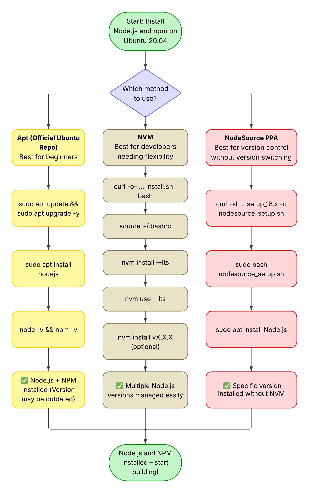

# 📑 Table of Contents

## 📘 Documentation Experience and Insight
- [Outline your experience with documentation](#outline-your-experience-working-on-software-documentation-think-about-its-type-audience-complexity-industry-context-how-you-made-a-difference-to-it-feel-free-to-include-a-link-to-any-publicly-visible-work-that-youd-like-to-share-with-us)
- [Most significant documentation work](#what-is-the-most-significant-body-of-documentation-that-you-have-had-responsibility-for)
- [Proudest documentation accomplishment](#what-is-your-proudest-success-or-accomplishment-as-a-technical-author)
- [Most used open-source docs](#what-open-source-software-documentation-do-you-use-the-most-how-would-you-suggest-improving-its-content)
- [Reflection on documentation project process](#consider-one-of-the-software-documentation-projects-you-have-worked-on-how-well-did-its-processes-work-and-what-would-you-like-to-improve)
- [Significant learning experience](#describe-a-significant-learning-experience-you-had-working-on-documentation---what-happened-what-did-you-learn-and-what-did-you-change-as-a-result)
- [Challenges in documentation work](#in-general-what-aspect-of-your-documentation-work-do-you-find-most-challenging-give-an-example-or-two-to-illustrate-the-nature-of-this-challenge)

## 💻 Software Experience
- [Programming skills and experience](#describe-your-programming-skills-and-experience-and-what-you-have-enjoyed-tell-us-as-much-as-you-like-and-feel-free-to-include-a-link-to-any-publicly-visible-work-that-youd-like-to-share-with-us)
- [Technology domain interests](#are-there-any-areas-of-software-technology-for-example-operations-cloud-services-infrastructure-and-application-management-and-deployment-linux-operating-systems-robotics-databases-or-others-in-which-you-have-particular-experience-or-interest)
- [Meaning of open source](#what-does-open-source-software-mean-to-you-personally)
- [Open-source involvement](#describe-any-experience-you-have-working-in-open-source-contexts-including-development-of-software-documentation-or-community)
- [Suggestions for improving OSS practices](#consider-one-of-those-contexts-did-you-observe-any-practices-that-you-would-like-to-improve)

## 🌍 Leadership and Professional Engagement
- [Speaking and public writing experience](#describe-any-speaking-experience-at-events-and-conferences-or-other-events-or-public-writing-about-documentation-or-software)
- [Industry influence](#what-influence-have-you-had-on-others-in-the-industry-through-your-speaking-writing-or-other-work)
- [Community engagement](#describe-your-engagement-or-participation-in-any-professional-or-industry-communities-that-focus-on-a-relevant-discipline-documentation-software-etc)

## 🎓 Education
- [High school ranking - STEM](#how-did-you-rank-amongst-your-peers-in-your-final-year-of-high-school-in-mathematics-and-the-sciences-what-was-your-strongest-subject)
- [High school ranking - Arts](#how-did-you-rank-amongst-your-peers-in-your-final-year-of-high-school-in-languages-and-the-arts-what-was-your-strongest-subject)
- [Exam results](#what-were-your-results-in-your-school-leaving-andor-university-entrance-examinations-gpa-ib-matriculation-a-levels-sat-act-etc)
- [Student personality and hobbies](#what-sort-of-high-school-student-were-you-beyond-your-studies-what-were-your-interests-and-hobbies-how-do-you-think-you-are-remembered-by-your-peers)
- [Degree and university choice](#what-degree-and-university-did-you-choose-and-why)
- [Strongest university subject](#at-university-did-you-do-particularly-well-in-any-area-of-your-degree)
- [Final degree result](#overall-what-was-your-degree-result-and-how-did-that-reflect-on-your-ability-note-that-different-education-traditions-around-the-world-use-different-scoring-systems-please-give-us-additional-context-so-that-we-understand-what-your-degree-result-indicates-even-if-were-not-familiar-with-that-particular-system)
- [Exceptional achievements](#in-high-school-and-university-what-did-you-achieve-that-was-exceptional)
- [Leadership roles in education](#what-leadership-roles-did-you-take-on-during-your-education)

## 🧭 Canonical in Context
- [Why Canonical?](#why-do-you-want-to-be-a-technical-author-at-canonical)
- [Products or domains of interest](#which-canonical-products-or-technology-domains-are-you-most-interested-in-working-on)
- [Canonical in the open-source market](#what-is-your-understanding-of-canonicals-position-in-the-open-source-software-market-what-strengths-and-weaknesses-do-you-see)

## 📄 Project Samples
- [Install Node.js + npm on Ubuntu](#install-and-configure-nodejs--npm-on-ubuntu-2004-step-by-step-guide)
- [Get Started with NASA API](#get-started-with-nasas-api)


# 📘 Documentation Experience and Insight

*In this section, we want you to show us what you can do. We want to understand what you think, how you think and how you earned your insights.*

## **Outline your experience working on software documentation (think about: its type, audience, complexity, industry context, how you made a difference to it). Feel free to include a link to any publicly-visible work that you’d like to share with us.** 

I have written a range of technical documentation—step-by-step tutorials, user guides, and API references—for diverse audiences. For example, I authored a guide titled ["Install and Configure Node.js + npm on Ubuntu"](#install-and-configure-nodejs--npm-on-ubuntu-2004-step-by-step-guide) aimed at developers getting started on Ubuntu, where I explained complex setup steps and package management in clear, concise language. I also created a comprehensive guide to NASA’s public APIs for data enthusiasts and researchers, breaking down advanced topics like authentication and data formats into digestible explanations and sample requests. Each document was carefully structured with headings, numbered steps, and code examples to improve usability, and I often iterated based on peer feedback to refine tone and clarity. In another project, I wrote a GitHub Pages tutorial (with custom domain setup) geared toward open-source contributors, where I emphasized consistent style and practical tips to avoid common pitfalls. Across all these projects, I focused on making complex information accessible: I edited jargon-heavy passages into plain language and added context where readers needed it. I am passionate about clear communication and continuously improving my work, and this user-focused approach demonstrates my growth mindset and dedication to effective documentation.

## **What is the most significant body of documentation that you have had responsibility for?**

When I lived in Vietnam, I used to work at school, called 'Language Bridge'. Over time, the school expanded and grew from one center to three. They needed to hire more teachers, and many of those were foreign teachers. The school administration asked me to write and present a code of conduct to a group of new teachers. The code of conduct included some aspects, as:

- Lesson planning

- Arrival time

- Vacation leave

- Uniform

- Critical situations

- Communication with parents
etc.

I created both a document and a visual presentation.

## **What is your proudest success or accomplishment as a technical author?**

My proudest accomplishment as a technical author was creating a complete beginner-friendly guide on installing Node.js and npm on Ubuntu — not just for the technical content, but for the clarity and confidence it gave to others.

I wrote the guide from scratch, tested every command in a clean environment, and explained each step in plain English. What made me proud was how I approached it as a teacher, not just a developer: anticipating reader questions, removing ambiguity, and turning something intimidating into something accessible.

Later, I shared it with early-career developers and ESL learners — and received messages saying it could help them succeed where official docs would fail.

## **What open-source software documentation do you use the most? How would you suggest improving its content?**  
  
After receiving the written interview questions from Holly Hall last Sunday, this particular question stood out to me — and it actually motivated me to start contributing. While both pull requests are still awaiting approval, here’s what I’ve submitted so far:

1) [TLDR Pages – Added a new section titled “VI. Periodic Maintenance Tasks” to the Maintainer’s Guide](https://github.com/tldr-pages/tldr/pull/16628)

I found an open issue in their repository that mentioned a lack of visibility into long-term maintainer responsibilities. I contributed a new section that outlines recurring tasks like reviewing staleness, link health, and automation checks.

2) [Scikit-learn – Added contextual links to improve code clarity in the SVM ANOVA example](https://github.com/scikit-learn/scikit-learn/pull/31451)

In this contribution, I added references to the official Scikit-learn documentation in the [plot_svm_anova.py](https://github.com/scikit-learn/scikit-learn/blob/main/examples/svm/plot_svm_anova.py) example. This helps users more easily understand how the code relates to core SVM and ANOVA features, especially if they’re not yet familiar with those concepts.

These contributions taught me that it’s more effective to focus on a small number of open-source projects. When you take the time to learn their style, structure, and workflows, you can spot issues more easily — and your contributions tend to align better with community expectations.

## **Consider one of the software documentation projects you have worked on. How well did its processes work, and what would you like to improve?**

My experience with software documentation has grown through a series of technical writing projects I’ve created independently and refined with help from experienced reviewers. I specialize in writing tutorials and API documentation for developers, especially those who are early in their learning journey or transitioning to new technologies.

For example, in my guide ["Install and Configure Node.js + npm on Ubuntu"](#install-and-configure-nodejs--npm-on-ubuntu-2004-step-by-step-guide) I wrote for developers setting up their environment on Linux. The complexity was moderate — it involved shell commands, repository setup, and system permissions. I made a difference by explaining why each command mattered and tailoring the tone for non-experts. The guide lives on GitHub and has been reviewed by others in the tech writing space:

["Install and Configure Node.js + npm on Ubuntu"](#install-and-configure-nodejs--npm-on-ubuntu-2004-step-by-step-guide)

Another project, “NASA API Documentation,” is a more technical reference and tutorial hybrid for the Astronomy Picture of the Day API. The audience is developers building apps or educational tools using the API. The project involved documenting endpoints, authentication, and usage examples, with a focus on clarity and usefulness.

[Get Started with NASA’s API](#get-started-with-nasas-api)

Though these were not full-time roles, I treated both projects like professional deliverables — outlining purpose, identifying target users, testing content, and incorporating feedback. I use Markdown, Git, and VS Code regularly, and I’m excited to bring this skillset into a collaborative, open-source-focused environment like Canonical’s.

## **Describe a significant learning experience you had working on documentation - What happened, what did you learn, and what did you change as a result?**  
 
After deciding to transition into technical writing, I didn’t just start building a portfolio — I also reached out to experienced professionals in the field for coffee chats. These conversations were incredibly helpful. They gave me honest feedback, suggested areas to focus on, and even reviewed some of my early writing samples.

One of the most impactful things I learned was how much thoughtfulness and precision technical writing really requires. A few key lessons that stuck with me:

- Every word matters — even small choices can affect clarity or tone.

- AI can assist, but it can also introduce subtle errors. You have to double-check everything.

- Good documentation starts with solid planning and research, not just good prose.

- Attention to detail is non-negotiable — especially in technical contexts where accuracy builds user trust.

- Always ask “Why?” — why include this step? Why word it this way? What’s the reader supposed to take away?

- Step away from the writing and come back later with a clear head — your editing will always be sharper.

As a result of these conversations and lessons, I completely changed how I approach writing. Now, I plan more carefully, review more critically, and focus more on the user's journey through the documentation.


## **In general, what aspect of your documentation work do you find most challenging? Give an example or two to illustrate the nature of this challenge.**  
 
One of the more challenging aspects of documentation for me — and I wouldn’t call it very challenging, just an area I keep working to improve — is deciding on the best order in which to present information. Structuring content isn’t just about logic; it’s about guiding the reader through a journey in a way that’s clear, intuitive, and even a little engaging.

For example, in my [Get Started with NASA’s API](#get-started-with-nasas-api) guide, I originally placed the Visual Demo after the JavaScript and Python code examples. But after reviewing the flow, I realized that a quick visual of what the API can do would actually motivate readers and give them immediate context — especially those less experienced with APIs. So I reorganized that section, putting the demo before the code to spark curiosity and provide a visual goal before diving into the technical details.

This experience taught me how important it is to think like a reader, not just a writer. Now, I often sketch an outline from the user’s perspective first — asking what they need to know, in what order, and how each section prepares them for the next.

---

# 💻 Software Experience

*You don't need to be a software engineer to be a technical author, but you do need technical curiosity and to share the programmer's mindset. We want to understand what software means to you, and why you care about it.*

## **Describe your programming skills and experience and what you have enjoyed. Tell us as much as you like, and feel free to include a link to any publicly-visible work that you’d like to share with us.**

I feel confident identifying as a junior developer. Last year, I completed the [Lighthouse Labs](https://www.lighthouselabs.ca/) full-stack web development bootcamp, and I’ll soon be starting another intensive training program with [ComIT](https://www.comit.org/) to reinforce my technical foundations and continue learning in a structured way.

My strongest language is JavaScript — I’m comfortable building both front-end and full-stack applications. I also have hands-on experience with Python and Ruby, particularly in scripting and API interactions.

Here are a few publicly-visible projects I’ve built:

[GrammarGPT](https://gptgrammar.netlify.app/)
An AI-powered grammar correction app that analyzes and explains mistakes in English sentences. It combines my background in education with my passion for accessible web tools.

[Medium Clone](https://medium-clone-as.netlify.app/)
A full-stack clone of Medium built using modern frameworks. Users can register, write articles, and engage with content — a great exercise in managing authentication, dynamic content, and user flows.

[Work Learn Travel](https://www.worklearntravel.ca/)
A production website I created for the company I work at, which helps young Canadians find work and travel opportunities abroad. It gave me experience with stakeholder feedback and building with a real audience in mind.

What I enjoy most about programming is bringing ideas to life — especially ones that help people or simplify something. While I don’t plan to become a full-time developer, coding will absolutely remain part of my toolkit as a technical writer. It helps me understand developer pain points, write better examples, and test documentation more effectively.


## **Are there any areas of software technology (for example: operations, cloud services, infrastructure and application management and deployment; Linux operating systems, robotics, databases, or others) in which you have particular experience or interest?**

I prefer developer tools, Linux environments, and backend infrastructure. I’ve spent a lot of time working with Git and Ubuntu, and I’ve used PostgreSQL, Firebase, and Prisma to manage databases in full-stack projects. On the backend, I’m comfortable with Node.js, Express, and Next.js.

Over time, I’ve gotten comfortable working in the terminal and navigating Linux systems. One of the docs I wrote was about installing Node and npm on Ubuntu, and for that, I tested every command on a clean install just to make sure it worked exactly as described — it helped me build confidence with Linux workflows and made me realize how much I enjoy writing docs that simplify technical environments.

I’m also curious to learn more about cloud infrastructure and DevOps. I’d like to go deeper into tools like Docker and CI/CD pipelines, and I’m especially interested in how technical writing can support these areas — whether that’s through setup guides, architecture diagrams, or troubleshooting workflows.

## **What does open-source software mean to you personally?**

To me, open-source software is an incredible opportunity to grow by contributing to real, living projects. Unlike starting something from scratch, you're stepping into something that’s already in motion — with its own style, structure, and user base. It teaches you how to navigate unfamiliar codebases, understand community standards, and find ways to make a meaningful contribution.

As someone passionate about technical writing, I see open-source as a chance to spot areas where the documentation could be clearer, more accessible, or better organized — and then improve them. It’s also a great way to practice collaboration, receive feedback, and become a better communicator while doing something that helps others.

## **Describe any experience you have working in open-source contexts, including development of software, documentation or community.**

After exploring a wide range of open-source projects, I realized it’s best to focus on just a few that truly interest you. Once I committed to that approach, I found it much easier to dig into a project, understand its purpose, and spot areas where I could contribute — especially when it comes to documentation.

I’ve learned the importance of taking the time to explore a project’s structure and community standards before jumping in. Reading through existing issues, past pull requests, and contributing guides helped me avoid guesswork. I also found that reaching out to maintainers or reviewers early on is a great way to clarify expectations and avoid rework.

Overall, I’ve gotten better at identifying the right projects for me, understanding them more deeply, and contributing more efficiently. It’s made the whole process more enjoyable and productive — and it’s helped me grow both as a writer and a collaborator.

## **Consider one of those contexts: did you observe any practices that you would like to improve?**
  
Yes — while setting up my environment to contribute using VSCode, I followed the project’s instructions closely but still ran into some package mismatch errors. It took a while to figure out the solution by digging through GitHub issues and external resources.

I think a dedicated “Troubleshooting” or “FAQ” section would’ve made a big difference. Just listing a few common setup problems and their solutions — especially those that other contributors have run into — could save people a lot of time and frustration. It’s a small addition, but it makes the onboarding experience much smoother, especially for first-time contributors.

---

# 🌍 Leadership and Professional Engagement

*A Canonical technical author is a participant, not a bystander. We want to know how you have made a difference to the professional practice of others.*

## **Describe any speaking experience at events and conferences or other events, or public writing about documentation or software.**

I’ve had quite a bit of experience speaking in front of groups, even if not always in technical settings. While working in Vietnam, I often acted as the MC during school events, holiday celebrations, and opening ceremonies — sometimes in front of large audiences. It helped me become comfortable with public speaking and learn how to engage diverse groups of people.

In my current role as an ESL instructor, I regularly present to new students, walking them through school policies, behavioral expectations, and orientation materials — all in a clear and welcoming way.

I’m also a member of [Calgary Agile](https://calgaryagile.com/), a local tech community group, where I help with hosting events. I typically give the opening and closing remarks during our meetups, welcoming attendees and summarizing key takeaways.

While I haven’t yet spoken at conferences about documentation specifically, these experiences have helped me become a confident, clear communicator — and I look forward to sharing more about writing and software as I grow in this field.

## **What influence have you had on others in the industry, through your speaking, writing, or other work?**

As I mentioned earlier, I’ve contributed to open-source projects like [tldr-pages](https://github.com/tldr-pages) and [scikit-learn](https://github.com/scikit-learn/scikit-learn), focusing on improving documentation to help contributors and users better understand and navigate these projects. While my contributions have been modest so far, they reflect my commitment to clarity, attention to detail, and community engagement.

Outside of open source, I regularly help newcomers and friends — especially those new to Canada — by reviewing and improving their resumes, making the language clearer and helping with layout and formatting. It’s a small way I use my writing and editing skills to support others in their career development.

## **Describe your engagement or participation in any professional or industry communities that focus on a relevant discipline (documentation, software, etc).**

I stay actively involved in Calgary’s local tech scene. I occasionally volunteer at events like [Tech Startup Weekend](https://www.techstars.com/communities/startup-weekend) and [Google Dev Fest](https://developers.google.com/community/devfest), hosted at [Platform Calgary](https://www.platformcalgary.com/). These events give me a chance to connect with early-stage innovators, contribute behind the scenes, and stay inspired by what others are building.

I'm also a regular participant at Calgary Agile meetups, where I help host and introduce speakers. It’s a simple role, but it lets me contribute to creating an inclusive space for open discussion around software development, agile practices, and team collaboration.

---

# 🎓 Education

*It is Canonical hiring policy to consider a candidate's academic record, as evidence of excellence and ability. Any information or context that helps us understand your attainment is helpful. Please provide as much concrete detail – including grades, awards, final results, and so on – as you can.*

## **How did you rank amongst your peers in your final year of high school in mathematics and the sciences? What was your strongest subject?**

In my final year of high school, I consistently ranked near the top of my class in mathematics, science, and especially physics. I genuinely enjoyed those subjects. I even had an extracurricular tutor in math and physics because I wanted to go deeper and understand how things work and how they're connected. That curiosity has stayed with me ever since.

My strongest subject overall was actually English language. I’ve always loved expressing ideas clearly and creatively, and that blend of analytical thinking from STEM with strong communication skills is what eventually led me toward technical writing.

## **How did you rank amongst your peers in your final year of high school in languages and the arts? What was your strongest subject?**

Thanks to my mom, who is an ESL teacher, I started learning English from a very young age. That early exposure gave me a head start—by the time I was in high school, I was consistently one of the top students in English. I loved reading as a kid. Some of my earliest favorites were The Berenstain Bears books, which made learning feel like a fun adventure. I also got really into scientific magazines — especially anything about dinosaurs or encyclopedias. English remained my strongest subject, and it laid the groundwork for my later work in teaching and technical writing.

## **What were your results in your school-leaving and/or university entrance examinations (GPA, IB, matriculation, A-levels, SAT, ACT etc)?**

I studied in a different country, so my grades don’t directly translate into the Canadian grading system. That said, I was a fairly hard-working student, especially in subjects I was passionate about like English, German, Literature, math, and science. I’ll admit there were a few subjects I studied just enough to pass — but overall, I stayed focused and curious, which helped me build a strong foundation for both my academic and professional journey.

## **What sort of high school student were you? Beyond your studies, what were your interests and hobbies? How do you think you are remembered by your peers?**

I was a curious and supportive student in high school. I enjoyed most subjects and was always willing to help classmates who asked. I never wanted to be better than others; I just wanted to earn a fair grade based on my effort and understanding.

Outside of class, I was really into the gym (still am), mixed martial arts, and history. In fact, I often found myself reading historical articles late into the night when I probably should have been doing homework. I especially enjoyed historical debates — not to prove others wrong, but to exchange perspectives and share knowledge.

I moved around quite a bit growing up, both within my country and internationally, so I made friends in many places. Despite being in new environments often, I was never one to cause conflict. I’ve always believed that words carry weight, and I tried to be thoughtful in how I communicated with others. I think my peers would remember me as calm, kind, and easy to talk to — someone who listened and tried to make others feel respected.

## **What degree and university did you choose, and why?**

I chose to study English and German Language & Literature because language was always my strongest subject. I’ve loved learning how language works, and I’ve been surrounded by it since childhood — especially thanks to my mom, who’s an ESL teacher. I completed both my bachelor's and master's degrees in this field, which sharpened my writing and communication skills and now support my work as a technical writer.

## **At university, did you do particularly well in any area of your degree?**

Yes, I did best in English Language, History of Languages, and Foreign Literature. I enjoyed exploring how language evolves and shapes meaning.

## **Overall, what was your degree result and how did that reflect on your ability? (Note that different education traditions around the world use different scoring systems. Please give us additional context so that we understand what your degree result indicates, even if we're not familiar with that particular system.)**

I earned a Master’s degree in English and German Language & Literature. My university didn’t use a GPA system like in Canada, but I graduated with strong results — especially in subjects like English Linguistics, Foreign Literature, and Academic Writing. I was always one of the better students in my class, and I put a lot of effort into understanding not just the language, but how it works and how to explain it clearly. 

## **In high school and university, what did you achieve that was exceptional?**

In high school, I was part of our school’s English language team and competed in contests against other schools.I really enjoyed representing my school that way.
At university, English Language was definitely my strongest subject. I consistently had some of the top grades in my class and was known for having a strong vocabulary.

## **What leadership roles did you take on during your education?**

During my time at university, I had a couple of small but meaningful leadership roles. One moment that stands out is when a group of representatives from various European universities visited our campus — I was chosen as one of the student hosts to greet them and show them around. It was a nice experience that helped me develop confidence and communication skills.

I was also part of a university comedy team, where I took on a more behind-the-scenes leadership role — managing sound and audio effects during performances. It might not sound like much, but it taught me the importance of timing, collaboration, and contributing to a team’s success in creative ways.

---

# 🧭 Canonical in Context

*In this section, we want to know how you see and understand Canonical and its mission.*

## **Why do you want to be a technical author at Canonical?**

I’m excited about the opportunity to be a Technical Author at Canonical for a few reasons.

First, I appreciate being selected for this writing interview — it shows that Canonical values thoughtful communication, and it gives me a chance to express not just my skills, but also my mindset.

Second, I genuinely like the title 'Technical Author'. To me, it reflects someone who not only writes, but has the 'technical authority' to explain complex systems clearly.

Another thing that stood out is that your Technical Authors are involved in the development process. That’s a big plus for me. I’ve spent a lot of time learning to code, and I’d love to bring that technical understanding into my documentation work.

Finally, I saw on your website that Canonical is a diverse team with people from many different backgrounds. I thrive in environments like that. I’m curious, open-minded, and always learning — I feel like I’d easiyl fit in.

## **Which Canonical products, or technology domains, are you most interested in working on?**

I'm particularly interested in working on Ubuntu Desktop and WSL (Windows Subsystem for Linux). I'm quite familiar with this environment. During my full-stack web development bootcamp, we used Ubuntu on WSL throughout the entire program. We started with the installation, terminal basics, and Git configuration, and used it daily for over six months to run and build full-stack applications.

Because of this hands-on experience, I feel comfortable navigating Ubuntu and helping others understand and use it effectively. I also have a personal project related to Ubuntu, so this domain feels like a natural fit — both technically and personally.

## **What is your understanding of Canonical’s position in the open-source software market? What strengths and weaknesses do you see?**  

After my research, I see Canonical as a big player in the open-source world, mainly because of Ubuntu — one of the most popular Linux distros out there. Here’s what I think about their strengths and weaknesses:

Strengths:

- Ubuntu is free, which makes it accessible for everyone.

- It’s generally safer and more secure compared to some other operating systems.

- Very developer-friendly thanks to the Bash shell and powerful Linux tools.

- It’s a versatile platform, used from desktops to servers and cloud environments.

Weaknesses:

- Many popular applications, especially for graphic design and gaming, don’t have official Linux versions yet.

- Ubuntu requires a bit more technical know-how compared to Windows or macOS, which can be intimidating for beginners.

- Gaming support has improved but still isn’t as comprehensive or smooth as on other platforms.

Overall, Canonical is doing an amazing job making open-source software accessible and usable for a wide audience. However, there’s still room to grow, especially for non-technical users.

---

# **Install and Configure Node.js + npm on Ubuntu 20.04: Step-by-step Guide**
## **Introduction**

[Node.js](https://nodejs.org/en/about) is a cross-platform, open-source JavaScript runtime environment that can run on server-side. [NPM](https://nodejs.org/en/learn/getting-started/an-introduction-to-the-npm-package-manager) (Node Package Manager) is a default package manager for Node.js.
By the end of this tutorial, you will have Node.js and npm installed using three different methods — whether you want the latest version, multiple versions, or long-term support (LTS) versions.
## **Prerequisites**
Before installing anything, make sure your system is up to date. Run this command directly in your Ubuntu terminal:
```bash
sudo apt update && sudo apt upgrade -y
```
This ensures your system has the latest version of packages.

## **Option 1 – Install via APT from Ubuntu Repositories (Beginner-Friendly)**
This is the most popular way to get the latest version of Node.js and npm.

1. **Install Node.js and npm**
```bash
sudo apt install -y nodejs
```

2. **Verify installation**
Check that Node.js is installed:
```bash
node -v
```
You will likely get Node.js 16.z.z or 18.w.w

For npm, run:
```bash
npm -v
```
You will likely get npm 8.z.z to 10.w.w


> ⚠️ **Warning:** If npm fails to install, run `sudo apt install npm`

You have successfully installed **Node.js** and **npm** using the apt method.

---

## **Option 2 - Install Using Node Version Manager (NVM)**
[NVM](https://github.com/nvm-sh/nvm?tab=readme-ov-file#about) allows you to install and switch between different versions of Node.js. Initially, you will get the latest versions for both Node.js and npm.

> 💡 **Tip: Why use NVM?**
>
> **NVM** is the preferred tool for developers because it allows you to **switch between Node.js versions** without affecting your system-wide (global) installation.  
>  
> This is especially useful when working on **multiple projects** that require different Node versions.


1. **Install NVM**
Run the following command:
```bash
curl -o- https://raw.githubusercontent.com/nvm-sh/nvm/v0.39.7/install.sh | bash
```
In your terminal, you'll see a message like this:
```bash
=> => Compressing and cleaning up git repository

=> nvm source string already in /home/labber/.bashrc
=> bash_completion source string already in /home/labber/.bashrc
=> Close and reopen your terminal to start using nvm or run the following to use it now:

export NVM_DIR="$HOME/.nvm"
[ -s "$NVM_DIR/nvm.sh" ] && \. "$NVM_DIR/nvm.sh"  # This loads nvm
[ -s "$NVM_DIR/bash_completion" ] && \. "$NVM_DIR/bash_completion"  # This loads nvm bash_completion
```

**Restart your terminal or run:**
```bash
source ~/.bashrc
```

> ⚠️ **Warning:** This command downloads and runs a script from the internet. Only use official sources like the [NVM GitHub](https://github.com/nvm-sh/nvm). You can inspect the script [here](https://raw.githubusercontent.com/nvm-sh/nvm/v0.39.7/install.sh) before running it.

2. **Install Node.js with NVM:**
Install the latest [Long Term Support](https://nodejs.org/en/blog/release/v20.9.0) (LTS) version of Node.js:
```bash
nvm install --lts
```
```bash
nvm use --lts
```

3. **Choose any other Node.js version**

To view the list of available versions, run:

```bash
nvm list-remote
```
Example output
```bash
        v22.4.1
        v22.5.0
        v22.5.1
        v22.6.0
        v22.7.0
        v22.8.0
        v22.9.0
        v22.10.0
        v22.11.0   (LTS: Jod)
        v22.12.0   (LTS: Jod)
        v22.13.0   (LTS: Jod)
        v22.13.1   (LTS: Jod)
->      v22.14.0   (Latest LTS: Jod)
        v23.0.0
        v23.1.0
        v23.2.0
        v23.3.0
        v23.4.0
```
Choose the version and install it:
```bash
nvm install v18.20.0
```
View the list of your installed Node.js versions:
```bash
nvm list
```
```bash
       v18.20.0
->     v19.9.0
       v22.14.0
default -> lts/* (-> v22.14.0)
iojs -> N/A (default)
unstable -> N/A (default)
node -> stable (-> v22.14.0) (default)
stable -> 22.14 (-> v22.14.0) (default)
```
The current version is marked with an arrow sign **->**, occasionally followed by some name aliases.

There are different aliases for the [long-term support releases](https://nodejs.org/en/about/previous-releases):
```bash
lts/* -> lts/hydrogen (-> N/A)
lts/argon -> v4.9.1 (-> N/A)
lts/boron -> v6.17.1 (-> N/A)
lts/carbon -> v8.17.0 (-> N/A)
lts/dubnium -> v10.24.1 (-> N/A)
lts/erbium -> v12.22.12 (-> N/A)
lts/fermium -> v14.21.2
lts/gallium -> v16.19.0 (-> N/A)
lts/hydrogen -> v18.13.0 (-> N/A)
```
You can install Node.js versions based on aliases as well. For example, to install the latest long-term support version, **Jod**, run this command:

```bash
nvm install lts/jod
```
```bash
Downloading and installing node v22.14.0...
. . .
Now using node v22.14.0 (npm v10.9.2)
```
You can switch any other version, using ```nvm use```:
```bash
nvm use v18.20.0
```
```bash
Now using node v18.20.0 (npm v10.5.0)
```
## **Option 3 - Install Using [NodeSource PPA](https://github.com/nodesource/distributions/blob/master/README.md)**
If you need a different version of Node.js, use a PPA (personal package archive) developed by NodeSource. PPAs have more available versions than default Ubuntu repositories. Node.js v20.x is available as of April 2025

1. **Choose your version**
Decide what version you want. For example, if you want Node.js 18.x, you'll use `setup_18.x`.

2. **Download the setup script**
Run the following command to download the setup script:
```bash
cd ~
curl -sL https://deb.nodesource.com/setup_18.x -o nodesource_setup.sh
```
3. **(Optional) Check the script**
Check the contents of the script before running it.

```bash
nano nodesource_setup.sh
```
You will see:
```bash
Logger Function
log() {
  local message="$1"
  local type="$2"
  local timestamp=$(date '+%Y-%m-%d %H:%M:%S')
  local color
  local endcolor="\033[0m"

  case "$type" in
    "info") color="\033[38;5;79m" ;;
    "success") color="\033[1;32m" ;;
    "error") color="\033[1;31m" ;;
    *) color="\033[1;34m" ;;
  esac
```
Press Ctrl + X to exit.

4. **Run the setup script**
Execute the setup script:
```bash
sudo bash nodesource_setup.sh
```
5. **Install Node.js + npm**
Next, install Node.js:
```bash
sudo apt install nodejs -y
```
6. **Verify installation**
Check that Node.js and npm are installed:
```bash
node -v
npm -v
```
Output:
```bash
v18.x.x
```

> ✅ **Success!** You have successfully installed Node.js and npm. Try building your first CLI app, install a popular framework like Express.js, or explore npm packages to extend your project.

## **Visual Summary - Node.js Installation Methods**

The diagram below provides a quick overview of the three different ways to install Node.js and npm on Ubuntu:



## **Which method should I Use?**

| Method             | Best for...                                 | Notes                                  |
|--------------------|---------------------------------------------|----------------------------------------|
| **Apt (Option 1)** | Beginners, simple installs                  | May not have the latest version        |
| **NVM (Option 2)** | Developers who need multiple Node versions  | Lightweight and flexible               |
| **NodeSource (Opt 3)** | Specific versions without using NVM     | Good for controlled version installs   |

> 💡 **Tip:** Only use **one installation method** at a time. If you mix `apt`, `nvm`, and `nodesource`, you might run into version conflicts.
- To remove previous installs:
```bash
  sudo apt remove nodejs npm
```

## Next Steps

Now that you have Node.js and npm installed, try:

- Creating your first Node.js script: `hello.js`

- Installing Express: `npm install express`

- Exploring npm packages: [npmjs.com](https://www.npmjs.com/)

- Creating a CLI tool or a REST API

Happy coding! 🚀

---

# Get Started with NASA’s API

## Overview

NASA's [Astronomy Picture of the Day](https://en.wikipedia.org/wiki/Astronomy_Picture_of_the_Day) (APOD) shares a new space-related image every day, each accompanied by a short explanation from a NASA astronomer. This documentation guides developers through the process of obtaining an API Key, making requests to the APOD API, and handling the JSON response to get the media content.

## Table of Contents
1. [Prerequisites](#prerequisites)
2. [Obtaining-an-api-key](#obtaining-an-api-key)
3. [Making API Requests](#making-api-requests)
4. [Handling API Responses](#handling-api-responses)
5. [Optional URL Parameters](#optional-url-parameters)
6. [Code Examples](#code-examples)
7. [Use Cases](#use-cases)
8. [Troubleshooting](#troubleshooting)
9. [Reference](#reference)

---

Before diving into the tutorial, here’s a quick visual preview of what you can build with the APOD API.

<!DOCTYPE html>
<html lang="en">
<head>
  <meta charset="UTF-8" />
  <meta name="viewport" content="width=device-width, initial-scale=1.0" />
  <title>APOD Example</title>

  <!-- ✅ Your CSS goes here -->
  <style>
    .apod h2 {
      text-align: center;
      font-weight: bold;
    }
    .apod {
      border: 1px solid #ccc;
      padding: 1em;
      margin: 1em 0;
      background:rgb(95, 137, 175);
      border-radius: 10px;
    }

    .apod img {
    display: block;
    margin: 0 auto;
    max-width: 100%;
    border-radius: 8px;
    }

    .apod-description {
      margin-top: 1em;
      font-size: 1.05rem;
    }

    .apod-facts ul {
      list-style-type: square;
      padding-left: 1.5em;
    }

    .apod-note {
      margin-top: 1em;
      background: #e3f2fd;
      padding: 0.75em;
      border-left: 5px solid #2196f3;
      border-radius: 6px;
      font-style: italic;
    }
  </style>
</head>

<body>
  <!-- Your APOD content -->
  <section class="apod">
    <h2>UGC 1810: Wildly Interacting Galaxy from Hubble</h2>
    
        <section class="apod-facts">
      <ul>
        <li><strong>Title:</strong> Veil Nebula: Wisps of an Ancient Supernova</li>
        <li><strong>Date:</strong> 2025-06-02</li>
      </ul>
    </section>
    <section class="apod-description">
      <p>Wisps like this are all that remain visible of a Milky Way star.  About 7,000 years ago that star exploded in a supernova, leaving the Veil Nebula.  At the time, the expanding cloud was likely as bright as a crescent Moon, remaining visible for weeks to people living at the dawn of recorded history.  Today, the resulting supernova remnant, also known as the Cygnus Loop, has faded and is now visible only through a small telescope directed toward the constellation of the Swan (Cygnus).  The remaining Veil Nebula is physically huge, however, and even though it lies about 1,400 light-years distant, it covers over five times the size of the full Moon.  The featured picture was taken in Kuwait in mid-2024 and features light emitted by hydrogen in red and oxygen in blue.  In deep images of the complete Veil Nebula like this, even studious readers might not be able to identify the iconic filaments.   Piece it All Together: Astronomy Puzzle of the Day.</p>
    </section>
  </section>
</body>
</html>


> 💡NOTE: This simple HTML page dynamically fetches and displays the Astronomy Picture of the Day using JavaScript.

---

## Prerequisites

To get started with the APOD API, make sure you have:
- Basic knowledge of JavaScript and HTML
- A code editor (e.g., [Visual Studio Code](https://code.visualstudio.com/))
- [Postman](https://www.postman.com/) API testing tool

## Obtaining an API Key

To access NASA's APIs:
1. Navigate to [NASA APIs](https://api.nasa.gov/)
2. Fill out the registration form with your first name, last name, and email address.
3. Submit the form to receive an email with your unique API Key.
> 💡NOTE: NASA's demo API Key is limited to 30 requests per IP address per hour or 50 requests per IP address per day. For increased limits, register for a free API Key.

## Making API Requests

The basic APOD API endpoint:
```bash
https://api.nasa.gov/planetary/apod?api_key=${YOUR_API_KEY}
```
Replace YOUR_API_KEY with your API key (or use `DEMO_KEY` for limited testing).

### JavaScript (Fetch API):

```javascript
const apiKey = 'YOUR_API_KEY';
const url = `https://api.nasa.gov/planetary/apod?api_key=${apiKey}`;

fetch(url)
  .then(response => response.json())
  .then(data => {
  console.log(data);
  })
  .catch(error => {
    console.error('Error fetching APOD:', error);
  });
```
This snippet uses the **Fetch API** to send a GET request and log the JSON response to the console.

### Test with Postman
To manually test the API using [Postman](https://www.postman.com/), follow these steps:
1. Open Postman and start a new tab
2. Select the `GET` type request.
3. Paste your request URL:
```bash
https://api.nasa.gov/planetary/apod?api_key=YOUR_API_KEY
```
4. Click **Send**
5. Receive the JSON response

## Handling API Responses

When **successful**, the APOD API returns a JSON object that includes the image or video of the day, its metadata, and a written description.

<details>
<summary>Click to view sample JSON response example</summary>

```json
{
  "copyright": "\nTaavi Niittee  \n(Tõrva Astronomy Club) \n",
  "date": "2025-04-16",
  "explanation": "What created the unusual halo around the Cat's Eye Nebula? No one is sure...",
  "hdurl": "https://apod.nasa.gov/apod/image/2504/CatsEyeWide_Niittee_960.jpg",
  "media_type": "image",
  "service_version": "v1",
  "title": "Halo of the Cat's Eye",
  "url": "https://apod.nasa.gov/apod/image/2504/CatsEyeWide_Niittee_960.jpg",
  ...
}
```
</details>

### Response fields

| Field            | Description                                                              |
|------------------|--------------------------------------------------------------------------|
| `title`          | Title of the image or video.                                             |
| `date`           | Date of the APOD in `YYYY-MM-DD` format.                                 |
| `explanation`    | Description written by a NASA astronomer.                                |
| `media_type`     | Either `image` or `video`.                                               |
| `url`            | Link to the image or video.                                              |
| `hdurl`          | High-definition image URL (if available).                                |
| `thumbnail_url`  | URL of the video thumbnail (if `thumbs=true` and media is a video).      |
| `copyright`      | Name of the media's copyright holder.                                    |
| `service_version`| Version of the API.                                                      |
| `concept_tags`   | Indicates if concept tags were requested.                                |
| `concepts`       | Array of relevant concept tags (if `concept_tags=true`).                 |

### Optional URL Parameters

Customize your request with the following URL query parameters:
| Param         | Type    | Description                                                                 |
|---------------|---------|-----------------------------------------------------------------------------|
| `date`        | string  | Specific date in `YYYY-MM-DD` format. Cannot be used with `count`.          |
| `start_date`  | string  | Start of a date range. Returns multiple results.                            |
| `end_date`    | string  | End of a date range (optional). Defaults to today if omitted.               |
| `count`       | int     | Returns a random list of images. Max: 100. Cannot be used with `date`.      |
| `thumbs`      | bool    | If true, returns a video thumbnail (only applies to video media).           |
| `api_key`     | string  | api.nasa.gov key for personal usage.                                        |

Examples:
```bash
https://api.nasa.gov/planetary/apod?api_key=YOUR_API_KEY&date=2024-10-01&concept_tags=true
```

## Code Examples

You can build a similar sample page as you saw at the beginning of the article using the JavaScript or Python code below. Try customizing the layout or styling to match your needs!

> 💡NOTE: Use **JavaScript** for client-side web applications, or **Python** for backend scripts and data processing.

---

### JavaScript Example: Client-Side Web App

```html
<!DOCTYPE html>
<html lang="en">
<head>
  <meta charset="UTF-8">
  <title>NASA APOD Viewer</title>
</head>
<body>
  <h1>NASA Astronomy Picture of the Day</h1>
  <div id="apod"></div>

  <script>
    const apiKey = 'YOUR_API_KEY';  // Replace with your API key
    const url = `https://api.nasa.gov/planetary/apod?api_key=${apiKey}`;

    fetch(url)
      .then(response => response.json())
      .then(data => {
        const container = document.getElementById('apod');
        container.innerHTML = `
          <h2>${data.title}</h2>
          <p><strong>Date:</strong> ${data.date}</p>
          
          <p>${data.explanation}</p>
        `;
      })
      .catch(error => {
        console.error('Error fetching APOD:', error);
      });
  </script>
</body>
</html>
```

### Python Example: Backend Script

```python
import requests

API_KEY = "YOUR_API_KEY"  # Replace with your API key
url = f"https://api.nasa.gov/planetary/apod?api_key={API_KEY}"

response = requests.get(url)  # Send the GET request to NASA's APOD API

if response.status_code == 200:
    data = response.json()
    print("Title:", data["title"])
    print("Date:", data["date"])
    print("URL:", data["url"])
    print("Explanation:", data["explanation"])
else:
    print("Failed to retrieve data. Status code:", response.status_code)
```

## Use Cases

NASA's APOD API can be used in a variety of projects. Here are some ideas:
1. Daily Image Website
Build a personal or public site that displays the Astronomy Picture of the Day. Use HTML/CSS/JavaScript to fetch and update the content daily via the API.

2. Desktop Widget or Wallpaper Rotator
Use the API to fetch a new image each day and set it as your desktop wallpaper (using Python with pywallpaper or platform-specific tools).

3. Mobile App
Integrate APOD into a mobile app using frameworks like React Native or Flutter, displaying daily space content in a beautiful layout.

4. Classroom/Education Tool
Use it to introduce astronomy in educational settings. Create an interactive gallery or timeline with daily images, explanations, and media types.

5. AI/ML Projects
Use the image metadata and explanations to build a dataset for natural language processing, concept extraction, or image classification.

## Troubleshooting

If you're experiencing issues with the APOD API, here are some common problems and their solutions:

**API Key Errors:**
- Problem: “API_KEY_INVALID” or similar message
- Solution: Double-check you copied your API Key correctly and didn’t accidentally include spaces or quotes.

<br>

**Rate Limit Exceeded**
- Problem: You hit the demo key’s rate limit.
- Solution: Register for a free API Key to unlock more requests (30 requests per hour with a demo key vs. higher limits with a registered key).

<br>

**Invalid Date Format**
- Problem: `date` parameter returns an error.
- Solution: Make sure the format is `YYYY-MM-DD`. Avoid dates before June 1995, when APOD started.

<br>

**Empty or Incomplete Response**
- Problem: The JSON response is missing fields like `hdurl`.
- Solution: Not all images have HD versions. Check `media_type` and use fallbacks where needed.

<br>

**Video Handling**
- Problem: Trying to display a video as an image.
- Solution: If `media_type` is `"video"`, use an `<iframe>` instead of ``, or request the `thumbnail_url` with `thumbs=true`.

**Example:** Handling Media Types in JS
```javascript
if (data.media_type === "image") {
  document.body.innerHTML += ``;
} else if (data.media_type === "video") {
  document.body.innerHTML += `<iframe width="600" src="${data.url}" frameborder="0" allowfullscreen></iframe>`;
}
```

## Reference
**GitHub APOD API Documentation**: [https://github.com/nasa/apod-api](https://github.com/nasa/apod-api)