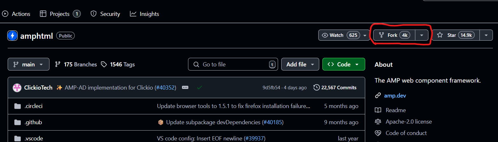
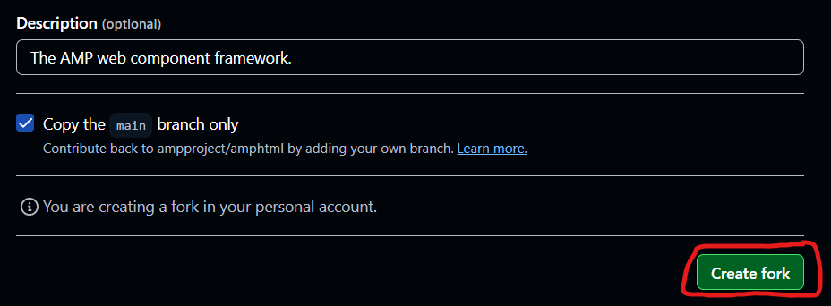

# How to Contribute to Open Source

## What is Open Source? (Definitions, examples with links, why contribute)

Open source is source code or documentation that is made freely available for possible modification and redistribution (source: [Wikipedia](https://en.wikipedia.org/wiki/Open_source))—often hosted on platforms like [GitHub](https://github.com/) or [GitLab](https://about.gitlab.com/). Simply put, anyone who believes in collaboration, transparency, and innovation can contribute to open source projects to make a positive impact.

You've probably used open-source tools without even realizing it! For example:
- [Mozilla Firefox](https://github.com/mozilla-firefox/firefox) – an open-source web browser
- [Linux](https://github.com/torvalds/linux) – the operating system behind Android and many servers
- [VS Code](https://github.com/microsoft/vscode) – a popular code editor

Why should you contribute?
Besides leaving your name in the project forever, contributing to open source is a great way to:
- Build your skills with real-world projects
- Collaborate with developers from around the world
- Strengthen your portfolio and resume
- Learn version control tools like Git in a practical way
- Grow your confidence as a coder and communicator

Whether you're fixing typos, writing documentation, or adding features—every contribution counts. Open source isn’t just about code; it’s about community.

## Where to Find Beginner-Friendly Projects?

Jumping into open source can feel overwhelming at first—especially if you're staring at thousands of unfamiliar projects on GitHub or GitLab. But don’t worry: there are some great websites designed to help beginners like you find the right place to start.

Here are a few go-to platforms where you can find beginner-friendly repositories, especially ones that welcome help with documentation, typos, or simple code fixes:
- [First Contributions](https://firstcontributions.github.io/)
This is one of the best places to start. It includes a step-by-step tutorial on how to contribute, and lists projects that are beginner-friendly. Many of them welcome documentation contributions.
- [Up For Grabs](https://up-for-grabs.net/)
A searchable database of projects that need help. You can filter by tags like `documentation`, `good first issue`, or your preferred programming language.
- [Good First Issue](https://goodfirstissue.dev/)
This site curates open GitHub issues labeled `good first issue`. These are usually well-scoped tasks with clear instructions—perfect for getting your feet wet.

Once you find a project that interests you—whether it's in ed tech, healthcare, climate data, or even developer tools—spend a few minutes browsing its README. Does the project excite you? Do you understand its purpose? If yes, that’s a great sign.

## Anatomy of Open Source Projects

Jumping into an open source project can sometimes feel overwhelming. Each project typically has a contribution guide, markdown formatting rules, and a folder structure.

Luckily, most open source projects share some common things:
- `README.md`

What it is: The front door of the project.
Purpose: Explains what the project does, how to install and use it, and sometimes how to contribute.
Why it matters: If you don’t understand the README, it may not be the right project for you (yet).
> **Tip**: Read this file carefully—it’s often your first guide to the project.

- CONTRIBUTING.md (also "Contributor's guide", "How to contribute", "Development" etc.)

What it is: A guide for contributors (like you).
Purpose: Tells you how to set up the project, submit issues, create pull requests (PRs), and follow coding/documentation standards.
Why it matters: Every project has different expectations. Reading this avoids accidental mistakes.
> **Tip**: Look for things like coding style rules, required tools, or review processes.

- `ISSUE` Tracker

Where it is: On GitHub under the “Issues” tab.
Purpose: A list of bugs, feature requests, and other tasks that need to be done.
Why it matters: This is where you’ll often find beginner-friendly issues labeled like `good first issue` or `help wanted`.
> **Tip**: Comment on an issue before working on it—many maintainers expect this.

- PULL REQUESTS

Where it is: On GitHub under the “Pull Requests” tab.
Purpose: This is where contributors propose changes to the project.
Why it matters: Your contribution won’t be added automatically—you submit a PR and wait for review.
> **Tip**: Be polite, write clear descriptions, and be open to feedback. It’s part of the process.

- LICENSE

What it is: A file that tells you how the project can be used or reused.
Purpose: Explains your legal rights to use, modify, and distribute the code.
Why it matters: Some licenses are very open (like MIT), while others have restrictions.
> **Tip**: You don’t need to be a lawyer—but knowing whether something is “free to use” is essential.

## Forking, Cloning, Branches, and Pull Requests

If you happen to see a mistake or would like to add or edit information in someone's book, you don't edit the original book—you make your own copy first, work on it, then suggest your changes. The same applies to open source projects.

After you found the project you want to edit, follow the steps below:

### 1. Forking. It's an essential first step, which creates a personal copy of the project under your GitHub account. You can't push directly to someone else's project.

Go to the project you found. Click the 'Fork' button to create a personal copy under your Github account.

It will lead you to the next page with the same URL + `/fork` extension. Click 'Create fork'.

Now you have your own copy of the open source project.

### 2. Cloning means copying the repository from GitHub to your local machine (your computer). This step is strongly recommended, as it's much more convenient to edit files in a code editor like VSCode than directly on GitHub.

In your terminal, run ` git clone https://github.com/your-username/project-name.git`
> **Tip**: Don't forget to replace 'project-name.git' with the real project name.

After cloning, run `cd project-name` to access the local repo.

### 3. Why and How to Create a Branch

By default, each repository has a branch. The default repository branch name is `main` or `master`. *Never* work on those branches. Create demo branches and work there first. Then, merge them with the original branch.
Think of it like signing an important  document—you wouldn't write directly on the original. Instead, you'd practice your signature on a copy first.

- When you are in your project folder in terminal, run `git branch` to confirm that you are currently on the `main` or `master` branch.
- Run `git checkout -b new_branch` to create and switch to a new branch (you can name it anything you like, e.g., `fix-typo` or `add-footer`).
- Make sure you are on the new branch and run `git branch`.
- You are ready to make changes safely.

### 4. Make Your Changes (Locally)
Now you can start working on the issue you chose. After you made changes, save your changes to your newly-created branch.
- Run `git add .` to add all the changes to your branch.
- Run `git commit -m "Describe your change"` to leave a commit message of what changes you made.

### 5. Push Your Branch Back to GitHub
- Run `git push` to push your changes to your GitHub account.
To check your commits on GitHub, go to `https://github.com/your-username/your-project-name/commits/your-branch-name` and you will see all the latest commits.

### 6. Open a Pull Request (PR)

Now it's time to propose your changes to the original project maintainers for review. In your forked project, click the green button "Compare & pull request" at the top.

You will get redirected to the pull request message page, where you'll have to describe your latest changes. Make sure you push your changes from your `new_branch` to the project's `main` or `master` branch.

## Writing Meaningful Commit Messages

Each open source project has its own requirements and contribution guide on how to open a pull request. As it was mentioned above, you can find the details on how to contribute in `CONTRIBUTING.md` (also "Contributor's guide", "How to contribute", "Development" etc.)

Normally, a good PR etiquette is:
- Write a clean title and description.
- Link to the issue (if any).
- Be polite and open to feedback.
> **Tip**: Reviewers might ask for changes—that's normal!

## Commit Git/GitHub Workflows
## How to Write Good Documentation as a Contributor