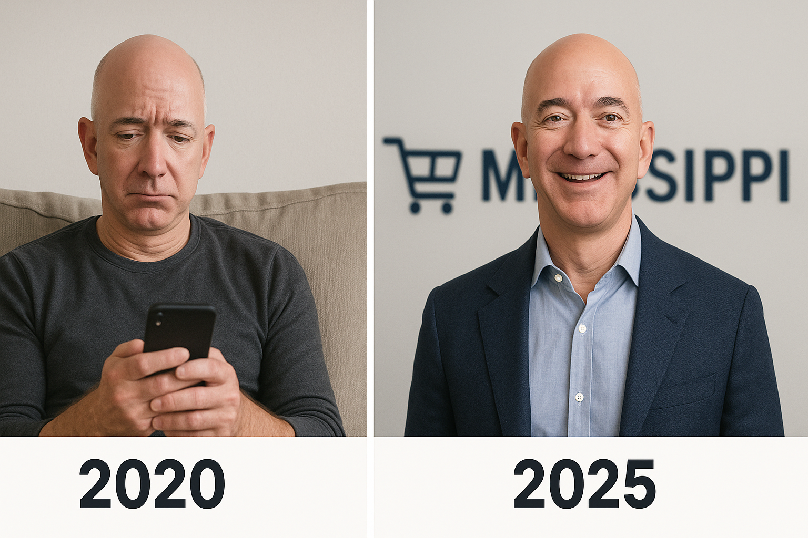

# Evening Productivity: How to Prioritize Tasks After a Long Workday

*"Stress doesn't come from hard work. Stress primarily comes from not taking action over something that you can have some control over."*–Jeff Bezos

After a long day of meetings, tasks, and social interactions, it’s tempting to collapse on the sofa, grab a snack or a drink, and zone out with a game or an episode of a series. That’s fine occasionally—but remember, your greater goal is waiting.

If you want to make progress in your career, achieve your personal goals, or keep your day productive, this article is for you.

In this post, you'll learn how to plan your after-work time effectively: what to start with and which tasks to do last, how to boost energy, improve focus, and eliminate distractions.

## What is "Evening Productivity", and Why It Matters
Evening productivity simply means using the hours after work with intention instead of having them disappear.
Whether you're studying foa certification, searching for a new job, or maintaining your fitness, evenings are a hidden block of time—about five hours a day on weekdays and much more on weekends. Used wisely, they add up to nearly 50 hours each week.

## Goals, Duties, and Recreation

First, define your priorities: career growth, learning a skill, improving your health, or something else. At the same time, you can't simply ignore housework or family responsibilities; chores, errands, and appointments will always be around. And remember about the most important—yourself. Deliberately leave space for what you love to do.

| **Goals**                                 | **Duties**                        | **Recreation**                                         |
|--------------------------------------------|-------------------------------------|--------------------------------------------------------|
| Study / Learning                           | Home & Admin (chores, bills, errands) | Recharge (movies, gaming, reading)        |
| Job Search & Networking / Professional Development | Family & Social (family responsibilities, caregiving) | Sports (gym, jogging)                    |
| Physical Well-Being (exercise, meal prep, sleep hygiene) | Appointments (dentist, doctor, bank visits, paperwork) |   Hobby, Socializing, Travel     |

## How Much Time Do You Really Have?
An average weekday: 8 hours work + 8 hours sleep = 8 hours left.
After commuting and basic tasks, you probably have about 5-6 free hours each workday and around 12 hours each weekend day—roughly up to 50 hours per week.

Realistically, you can devote for your:
- Goals: 25–30 hrs (≈50–60%)
- Duties: 10–12 hrs (≈20–25%)
- Recreation: 10–12 hrs (≈20–25%)

## How to Structure Your Evening Tasks for Maximum Productivity
When you arrive home from work, gradually start with duties. Spend time with family or handle some small chores. It will give you a mental buffer between work and personal goals.
Next, get down to your goals. Start with some easy to do tasks, like answering an email or reviewing study material. This prevents overwhelm and gives the satisfaction of ticking off  tasks. Before bed, take some time away from the screen, read, review plans for the next day, or—best of all—spend time with loved ones.

Typical time distribution:
Weekday: Duties 2 hrs • Goals 3 hrs • Recreation 1 hr
Weekend: Duties 3 hrs • Goals 6 hrs • Recreation 6 hrs

## Quick Tips to Improve Evening Productivity and Focus
- **Write a weekly to-do list** and update it daily. “If you fail to plan, you are planning to fail.”–Benjamin Franklin
- **Start with two hours of goal-oriented tasks** for a week or two, then gradually increase to three hours or more.
- **Maintain good posture** while working at the desk or studying; good alignment keeps energy up.
- **Move your body**. A walk or light jog boosts brain oxygen, sparking creativity and improving sleep..
- **Take a power nap** if needed. Sleep is the most effective way to restart your brain.
- **Reward yourself** with a snack, a drink, or some playtime with your pet—ideally without screen.
- **Use focus tools.** Screen-time trackers or site blockers remove distractions, like social media, email, and other interruptions.

## Example
Let's say you live with a spouse and a child or two. You work a "survival job", but want to become a web developer. You return home at 5 PM. A sample weekly schedule may look like this:

### Weekly Evening Schedule (5–11 PM, G = Goal • D = Duty • R = Recreation)

| Time     | Mon                        | Tue                  | Wed                           | Thu                        | Fri                           |
| -------- | -------------------------- | -------------------- | ----------------------------- | -------------------------- | ----------------------------- |
| 5–6 pm   | D – Family/kid time        | D – Family/kid time  | D – Family/kid time           | D – Family/kid time        | D – Family/kid time           |
| 6–7 pm   | D – Dinner & chores        | D – Dinner & chores  | D – Dinner & chores           | D – Dinner & chores        | D – Dinner & chores           |
| 7–8 pm   | G – Coding / Online course | G – Job applications | G – Portfolio update          | G – Coding / Online course | G – Resume & personal project |
| 8–9 pm   | G – Coding / Online course | G – Job applications | G – Portfolio update          | G – Coding / Online course | G – Resume & personal project |
| 9–10 pm  | G – Reading / notes        | G – Reading / notes  | G – Networking / side project | G – Side project           | G – Reading / notes           |
| 10–11 pm | R – Relax / reading        | R – Relax / reading  | R – Relax / reading           | R – Relax / reading        | R – Relax / reading           |

Weekday Totals:
- Goals: 3 hrs/day × 5 = 15 hrs
- Duties: 2 hrs/day × 5 = 10 hrs
- Recreation: 1 hr/day × 5 = 5 hrs

## Weekend Schedule (Sat–Sun, 8 AM–11 PM, G = Goal • D = Duty • R = Recreation)
| Time                         | Sat                    | Sun                    |
| ---------------------------- | ---------------------- | ---------------------- |
| **Morning (8 am – 12 pm)**   |                        |                        |
| 8–10 am                      | G – Coding project     | G – Study / course     |
| 10–12 pm                     | G – Portfolio build    | G – Networking tasks   |
| **Afternoon (12 pm – 5 pm)** |                        |                        |
| 12–1 pm                      | D – Meal prep / chores | D – Meal prep / chores |
| 1–3 pm                       | G – Study session      | G – Skill practice     |
| 3–4 pm                       | R – Sports / gym       | R – Sports / gym       |
| 4–5 pm                       | R – Walk / leisure     | R – Walk / leisure     |
| **Evening (5 pm – 11 pm)**   |                        |                        |
| 5–6 pm                       | D – Family activity    | D – Family activity    |
| 6–7 pm                       | D – Dinner / chores    | D – Dinner / chores    |
| 7–8 pm                       | R – Hobby / social     | R – Hobby / social     |
| 8–9 pm                       | R – Movie / reading    | R – Movie / reading    |
| 9–11 pm                      | R – Relax / reading    | R – Relax / reading    |

Weekend Totals:
- Goals: 12 hrs
- Duties: 6 hrs
- Recreation: 12 hrs

Evening productivity isn't about filling every free minute with tasks. It's about taking control of your evenings—and, by extension, your week and life. Try it, and you will soon notice how much easier it is to fall asleep knowing you made the most of your day. You'll enjoy your free time even more, savoring it fully because it comes after dedicated, purposeful effort.

This is Jeff Bezosky. He used to live an average life, but in 2020, he was lucky to come across our free [Weekly Evening Planner Template](https://andrii-stefankiv.netlify.app/). Ever since, he got his life in order, moved to San Francisco, and even established his e-commerce company,  "Mississippi." If you start today, your weekly tasks would look something like **6 PM - Personal driver pick up**.
Get your [free template](https://andrii-stefankiv.netlify.app/) today and start taking control of your evenings—just like Jeff did!

<!-- Checklist Before Publishing
Did you provide clear, actionable steps to accomplishing the task your reader needed help with?
Did you provide relevant and accurate facts and stats to prove your understanding of the concept?
Did you emphasize the importance of understanding this concept if it is not already well-known?
Did you properly cite and backlink your sources?
Did you spell check and proofread?
Are there at least 1-2 images?
Is the post 800-1,000 words at minimum? -->

## References & Further Reading
- [How Evening Planning Improves Productivity and Sleep](https://www.sciencedirect.com/science/article/pii/S2095254624000796) – peer-reviewed study on evening routines.
- [Evening Planning Tips (YouTube)](https://www.youtube.com/watch?v=W65PKHuiZHY) – 5-minute explainer video.