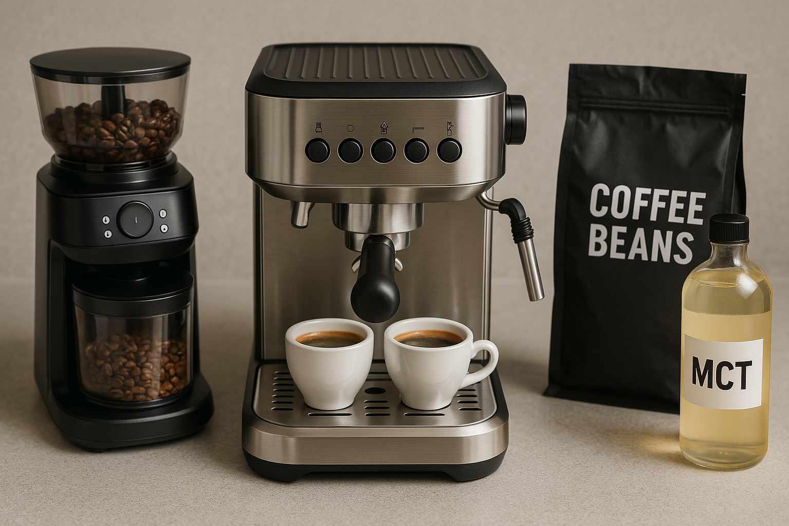

# ☕ How to Start Brewing Bulletproof Espresso at Home
## ✅ Learn how to choose the right equipment, proper coffee beans and other ingredients for your bulletproof coffee.
Bulletproof espresso can help:
- ✅ Provide a gradual release of energy
- ✅ Support your digestive health
- ✅ Manage your blood sugar
- ✅ Aid in weight loss

---

## 🧰 Things You Will Need:
- Espresso machine
- Bean grinder
- Coffee beans
- Oil (MCT, coconut, or butter)
- Espresso cups

---

## 🔧 Beginner-Friendly Espresso Machine
#### Choose a simple machine that won't overwhelm you. Consider:
- Intuitive controls and features that simplify the brewing process.
- Clear instructions and online tutorials.
- Stable pump with consistent pressure.
- Easy to disassabmle and clean machine.

---

## ⚙️ Find a Convenient Grinder
### A good coffee bean grinder determines most of your brewing experience and taste.
> 💡 **!Note:** If your espresso machine already has a built-in grinder, you may skip this section.

**A good grinder should have**:
- **Grind modes:** Consistent grind size (fine for espresso)
- **Serving amount selector:** Precise portioning

**Avoid blade grinders due to:**
- ❌ **Inconsistent grind size**
- ❌ **Manual bean measurement every time**

---

## 🌱 Type of bean roast
### There are four main roast levels:
- **Light roast** — Bright acidity, fruity or floral notes  
- **Medium roast** — Balanced acidity and sweetness  
- **Medium-dark roast** — Lower acidity, bittersweet notes  
- **Dark roast** — Bold, smoky, heavy-bodied  

### Which one is best for you?
- Most popular: **Medium-dark roast** or **dark roast**
- Alternative: **Medium roast** for balanced flavor

---

## 🧈 Oils for Bulletproof Espresso
### Adding oil slows caffeine absorption and gives smoother energy.
- **MCT oil** — Fast-absorbing liquid fat for clean energy 
- **Coconut oil** — Healthy fats, tropical flavor, solid when cold
- **Butter** — Rich, creamy texture

---

## 🍬 Optional: Add Flavors & Sweeteners
### Use only keto-friendly sweeteners:
- **Monk fruit sweetener** — Zero-calorie, no blood sugar spike
- **Erythritol** — Low-calorie sugar alcohol
- **Allulose** — Sugar mimic with almost zero impact

---

## ☕ The Best Espresso Cup

- Holds **2–3 oz (60–90 ml)**  
- Enough for a **single or double shot** with room for oil/sweeteners  

---

## 🧪 Step-by-Step Brewing Guide
### Once you have all the items above, let's start:
1. **Add oil and sweetener** to your espresso cup
2. **Place a cup** on the drip tray
3. **Measure coffee beans** 18 to 20 grams (for a single shot).
4. **Grind the beans** to a fine espresso texture
5. **Transfer the grounds to portafilter basket**, level the grounds, tap the portafilter to get the flat surface
6. **Tamp the grounds** with firm, level pressure
7. **Clean portafilter edges** to ensures a tight, clean lock
8. **Lock portafilter and position the cup** under the spout
9. **Start brewing**
10. **Monitor the brewing process** start - dark drips, then - steady streams, becomes golden

---

## 🎉 Enjoy Your Bulletproof Espresso!
Drink immediately while hot. Stir if oil separates. Enjoy the smooth, energetic kick!