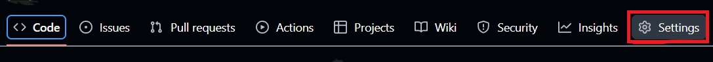
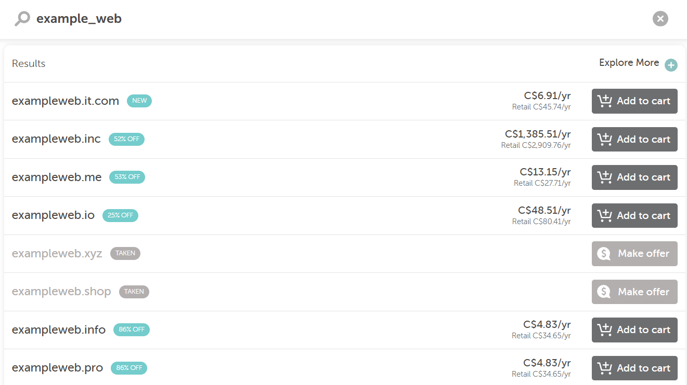
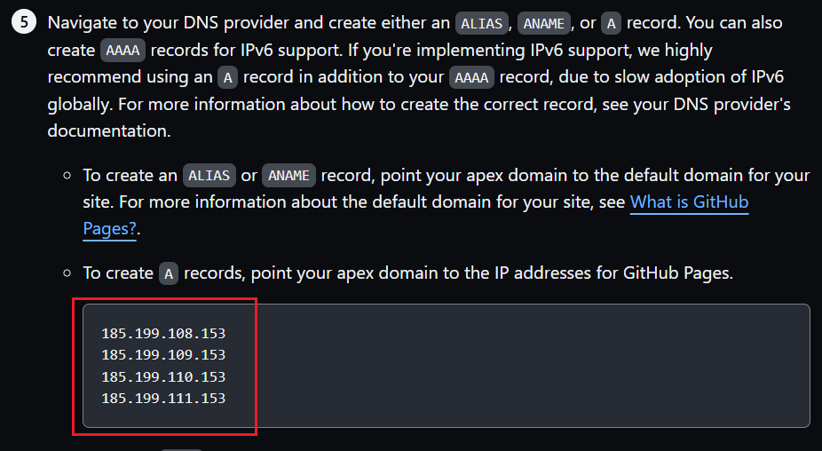

### 🌐 How to Setup a Github Page With a Custom Domain

## **Introduction**
[GitHub](https://github.com/) is a developer platform used to host code, collaborate on projects, and build and publish websites for free using [GitHub Pages](https://pages.github.com/).

With Github Pages, you can turn your repository into a live website. If you want to make your website look more professional, you can connect it to a custom domain `(e.g., yourname.com)`, instead of using GitHub’s default domain `(e.g., username.github.io)`.

By the end of this tutorial, you will learn how to:
- Create and publish Github Page
- Register a custom domain
- Connest your domain to your Github Page
- Enable HTTPS for security

## **Prerequisites**
To get started, make sure you have the following:
- A Github account

> If you don't have one, go to https://github.com/join, type a user name, email address, and a password, and follow the instructions.
- Basic git knowledge

You only need to understand how repositories, commits. and branches work. Go to [Github Hello World guide](https://docs.github.com/en/get-started/start-your-journey/hello-world#introduction) to get started.
- A domain registrar account

You can register at [Namecheap](https://www.namecheap.com/), [GoDaddy](https://www.godaddy.com/), or any other registrar you prefer.

## Step 1 - Create a Github Page
Go to your Github account. In the top-left corner click a **New** button to create a new repository.

Enter the repository name. This name will be temporarily displayed as your domain name.
At the bottom, click **Create repository** button.

To enable your page, create at least one file. In your repository, click **creating a new file** button.


> You may use other options to create files, like uploading an existing file or initiate a repository and edit it from VSCode.

Let's create our first file:

1. In the top-left corner, name the file **index.html**.

2. In the edit field, paste:
```bash
<!DOCTYPE html>
<html lang="en">
<head>
  <meta charset="UTF-8" />
  <meta name="viewport" content="width=device-width, initial-scale=1.0" />
  <title>Hello World</title>
</head>
<body>
  <h1>Hello, World!</h1>
  <p>This is a test GitHub Page.</p>
</body>
</html>
```
> You may edit your website later, as you want.

3. In the top-right corner, click **Commit changes...**

4. Add a commit message like: *Create index.html*

5. Click “Commit changes”

You are now ready to enable your github page.

## Step 2 - Enable GitHub Pages
Enabling your github page makes it available for others and generates a link, which you can share with the others.

1. Go to your repository **Settings**


2. Select **Pages**
3. Choose your **branch** (e.g., main)
4. Choose the **folder**: / (root)
5. Click **Save** and wait for about 1 minute.
6. Refresh the page.
7. Click **Visit site** to see your page in browser:


Your link is active now!

## Step 3 - Register a Custom Domain (Ex: Namecheap registrar)
1. Go to https://ap.www.namecheap.com/ and sign up.
2. Sign in and enter a desired domain address. Eg,. *example_web*. You will see a list of available domains and different pricings, depending on domain extensions.


3. Choose your desired domain and proceed to checkout.
4. Go to your dashboard https://ap.www.namecheap.com/dashboard


5. In your github website repository, go to **Settings** -> **Pages**. Under **Custom domain** section, click the link **Learn more about configuring custom domains**. Choose **Managing a custom domain for your GitHub Pages site** and proceed to section 5, where you will find **A** records.


6. Click **Manage** on the right.

7. Choose the **Advanced DNS** tab. Add your github repository four **A** records to your namecheap DNS settings, one by one.
8. Click **ADD NEW RECORD**.


9. Choose **A Record** from a dropdown menu. Host - @. Value - your github **A** record.


10. Repeat the process three more times.
11. Add a **CNAME Record**. Host - www. Value - your website domain.


> You may need to wait for up to 30 minutes until your domain is registered. Check your domain registration at https://dnschecker.org/

## Step 4 - Configure DNS Settings on the Domain Registrar

## Step 5 - Add Your Custom Domain in Github
In your github website repository:
1. Go to **Settings** -> **Pages**.
2. Under **Custom domain** section, paste your website domain (e.g,. exampleweb.shop)
3. Save changes. After a few seconds, you will get a confirmation message **DNS check successful**.

## Step 6 - Enforce HTTPS and Final Verification

## Troubleshooting and Tips

## Conclusion