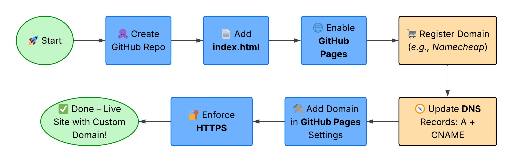
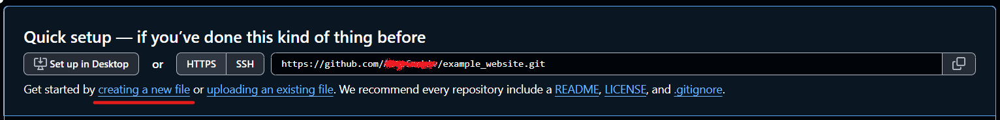
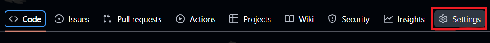
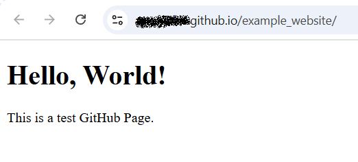
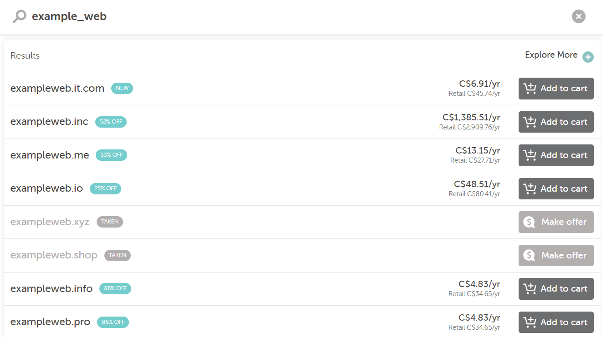
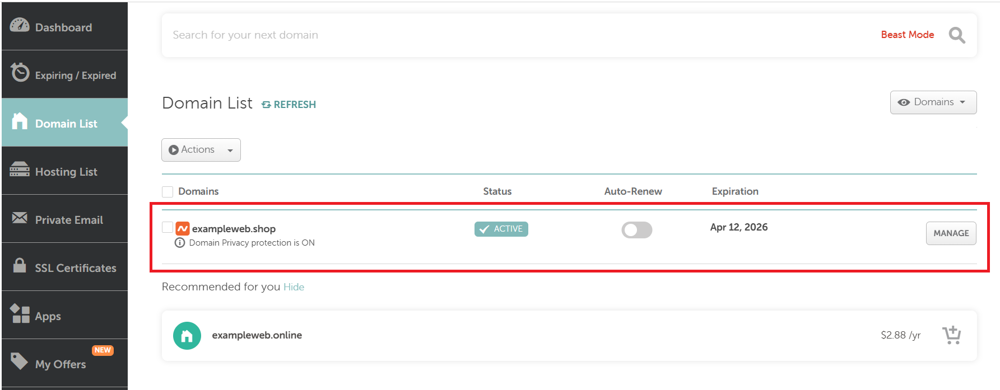
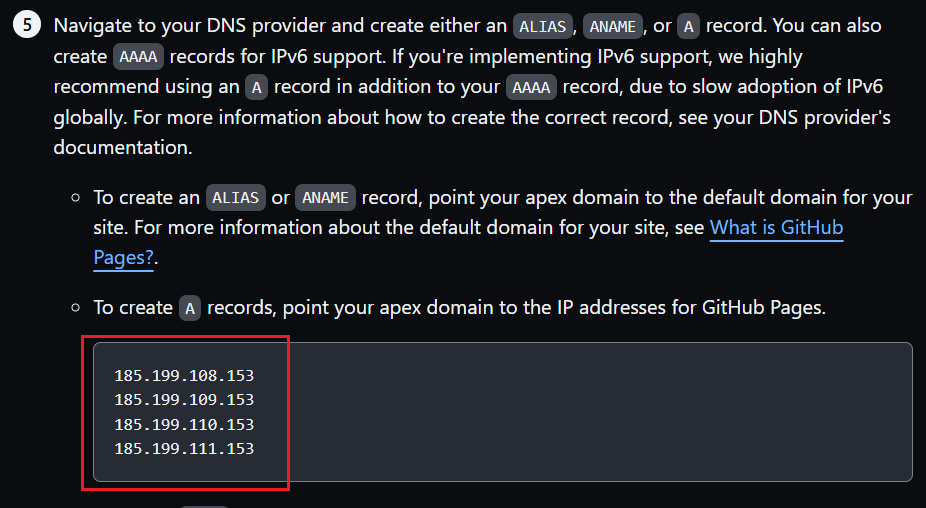
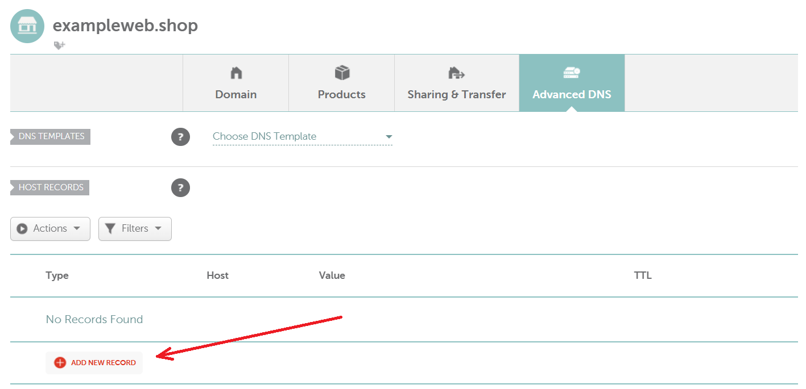
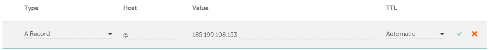

# How to Setup a Github Page With a Custom Domain

## **Introduction**
[GitHub](https://github.com/) is a developer platform used to host code, collaborate on projects, and build and publish websites for free using [GitHub Pages](https://pages.github.com/).

With Github Pages, you can turn your repository into a live website. If you want to make your website look more professional, you can connect it to a custom domain `(e.g., yourname.com)`, instead of using GitHub’s default domain `(e.g., username.github.io)`.

By the end of this tutorial, you will learn how to:
- Create and publish a Github Page
- Register a custom domain
- Connect your domain to your Github Page
- Enable HTTPS for security

### Overview of the Setup Process
Here’s a quick visual summary of the entire process we’ll cover in this guide:



We’ll go step-by-step through this journey—from creating a GitHub Page to securing it with HTTPS on your custom domain.

## **Prerequisites**
To get started, make sure you have the following:
- A Github account

> If you don't have one, go to https://github.com/join, type a user name, email address, and a password, and follow the instructions.
- Basic git knowledge

You only need to understand how [repositories](https://docs.github.com/en/repositories/creating-and-managing-repositories/about-repositories), [commits](https://docs.github.com/en/pull-requests/committing-changes-to-your-project/creating-and-editing-commits/about-commits), and [branches](https://docs.github.com/en/pull-requests/collaborating-with-pull-requests/proposing-changes-to-your-work-with-pull-requests/about-branches) work. Go to [Github Hello World guide](https://docs.github.com/en/get-started/start-your-journey/hello-world#introduction) to get started.
- A domain registrar account

You can register at [Namecheap](https://www.namecheap.com/), [GoDaddy](https://www.godaddy.com/), or any other registrar you prefer.

## Step 1 - Create a Github Page
Go to your Github account. In the top-left corner click the **New** button to create a new repository.

Enter the repository name. This name will be temporarily displayed as your domain name.
At the bottom, click **Create repository** button.

To enable your page, create at least one file. In your repository, click **creating a new file** button.


> You can also create files by uploading them, or by initializing your repository and editing it in a code editor like VSCode.

Let's create our first file:

1. In the top-left corner, name the file **index.html**.

2. In the edit field, paste:
```bash
<!DOCTYPE html>
<html lang="en">
<head>
  <meta charset="UTF-8" />
  <meta name="viewport" content="width=device-width, initial-scale=1.0" />
  <title>Hello World</title>
</head>
<body>
  <h1>Hello, World!</h1>
  <p>This is a test GitHub Page.</p>
</body>
</html>
```
> You may edit your website later, as you want.

3. In the top-right corner, click **Commit changes...**

4. Add a commit message like: *Create index.html*

5. Click “Commit changes”

You are now ready to enable your GitHub page.

## Step 2 - Enable GitHub Pages and Publish Your Site
Enabling your GitHub Pages will publish your site and give you a public URL to share.

1. Go to your repository **Settings**


2. Select **Pages**
3. Choose your **branch** (e.g., main)
4. Choose the **folder**: / (root) (this means your main directory)
5. Click **Save** and wait for about 1 minute.
6. Refresh the page.
7. Click **Visit site** to see your page in browser:



Your link is active now!

## Step 3 - Register a Custom Domain (Using Namecheap)
1. Go to https://ap.www.namecheap.com/ and sign up.
2. Sign in and enter a desired domain address. Eg,. *example_web*. You will see a list of available domains and prices, depending on domain extensions.


3. Choose your desired domain and proceed to checkout.

## Step 4 - Configure DNS Settings on the Domain Registrar
1. Go to your dashboard https://ap.www.namecheap.com/dashboard



2. In your GitHub website repository, go to **Settings** -> **Pages**. Under **Custom domain** section, click the link **Learn more about configuring custom domains**. Choose **Managing a custom domain for your GitHub Pages site** and proceed to section 5, where you will find **A** records.

> An A record maps your domain to an IP address.


3. Click **Manage** on the right.

4. Choose the **Advanced DNS** tab. Add your GitHub repository four **A** records to your namecheap DNS settings, one by one.
5. Click **ADD NEW RECORD**.


6. Choose **A Record** from a dropdown menu. Host - @. Value - your GitHub **A** record.


7. Repeat the process three more times.
8. Add a **CNAME Record**. Host - www. Value - your GitHub Pages domain.

>A  CNAME links subdomains like www to another domain


> You may need to wait for up to 30 minutes until your domain is registered. Check your domain registration at https://dnschecker.org/

## Step 5 - Add Your Custom Domain in Github
In your GitHub website repository:

1. Go to **Settings** -> **Pages**.
2. Under **Custom domain** section, paste your website domain (e.g,. exampleweb.shop)
3. Save changes. After a few seconds, you will get a confirmation message **DNS check successful**.

## Step 6 - Enforce HTTPS and Final Verification
After you’ve added your custom domain and configured your DNS records, GitHub Pages allows you to enable HTTPS (recommended).

1. Go to your GitHub repository -> **Settings -> Pages**
2. Under **Custom domain**, check the box for **Enforce HTTPS**
3. GitHub will validate your domain and apply a certificate automatically
4. You should see a green **"DNS check successful"** message

> If this step is taking long, wait 10–15 minutes and refresh the page. DNS propagation can take time depending on your registrar.

Once that’s done, try visiting your website.
You should see your **"Hello World"** site, now served over HTTPS!

## Troubleshooting

### My custom domain doesn’t work / shows a GitHub 404 page
- Make sure you entered your domain correctly in the Custom domain field under Repository → Settings → Pages.

- Wait at least 15–30 minutes. DNS changes take time to propagate.

- Use https://dnschecker.org to confirm your A and CNAME records are live globally.

- Your repo should have an index.html (or similar) in the root if you're publishing from the / folder.

### “DNS check failed” error on GitHub Pages
- Double-check that your A records point to the correct GitHub IP addresses:
```bash
185.199.108.153
185.199.109.153
185.199.110.153
185.199.111.153
```
- Ensure you added a CNAME record for www pointing to your domain (e.g., exampleweb.shop).
- Try removing the custom domain in GitHub Pages and re-adding it after 15 minutes.

### HTTPS option is not available or not working
- Wait up to 30 minutes after setting up DNS records. GitHub needs time to issue an SSL certificate.

- Make sure your DNS records are only pointing to GitHub’s servers—some registrars add default A records that conflict.

- Go to Settings -> Pages and manually check the Enforce HTTPS box once it's available.

## Going Further
Now that your site is live with a custom domain, you might consider:

- Creating a personal portfolio using HTML/CSS
- Building a static blog using [Jekyll](https://jekyllrb.com/) or [Eleventy](https://www.11ty.dev/)
- Embedding JavaScript to make your site interactive
- Using GitHub Actions to automate deployments