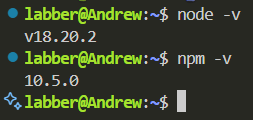

# Install and Configure Node.js + npm on Ubuntu 20.04: Step-by-step guide
**Introduction**

[Node.js](https://nodejs.org/en/about) is a cross-platform, open-source JavaScript runtime environment that can run on server-side. [NPM](https://nodejs.org/en/learn/getting-started/an-introduction-to-the-npm-package-manager) (Node Package Manager) is a default package manager for Node.js.
By the end of this tutorial, you will have Node.js and NPM installed using three different methods — whether you want the latest version, multiple versions, or long-term support (LTS) versions.
## Prerequisites
Before installing anything, make sure your system is up to date. Run this command directly in your Ubuntu terminal:
```bash
sudo apt update && sudo apt upgrade -y
```
This ensures you have the latest version of packages on your Ubuntu system.
## Option 1 - Using Apt from Ubuntu Repos (recommended)
This is the most popular way to get the latest version of Node.js and NPM.
### Step 1 - Install Node.js and NPM
```bash
sudo apt install -y nodejs
```
### Step 2 - Check if the installation was successful
```bash
node -v
```
You will get Node.js 16.z.z or 18.w.w
```bash
npm -v
```
You will get NPM npm 8.z.z to 10.w.w



>If NPM failed to install, run ```sudo apt install npm```

You have successfully installed **Node.js** and **NPM**
## Option 2 - Using [Node Version Manager](https://github.com/nvm-sh/nvm?tab=readme-ov-file#about) (NVM)
NVM allows you to intall and switch between different versions of Node.js. Initially, you will get the latest versions for both Node.js and NPM.
### Step 1 - Install NVM
```bash
curl -o- https://raw.githubusercontent.com/nvm-sh/nvm/v0.39.7/install.sh | bash
```
In your terminal, the last lines will look something like this:
```bash
=> => Compressing and cleaning up git repository

=> nvm source string already in /home/labber/.bashrc
=> bash_completion source string already in /home/labber/.bashrc
=> Close and reopen your terminal to start using nvm or run the following to use it now:

export NVM_DIR="$HOME/.nvm"
[ -s "$NVM_DIR/nvm.sh" ] && \. "$NVM_DIR/nvm.sh"  # This loads nvm
[ -s "$NVM_DIR/bash_completion" ] && \. "$NVM_DIR/bash_completion"  # This loads nvm bash_completion
```

#### Restart your terminal or run:
```bash
source ~/.bashrc
```
### Step 2 - Install Node.js with NVM:

```bash
nvm install --lts
```
```bash
nvm use --lts
```
You will get the latest Node.js version.

### Step 3 - Choose any other Node.js version

See the list of available versions (it's much longer):

```bash
nvm list-remote
```
Example output
```bash
        v22.4.1
        v22.5.0
        v22.5.1
        v22.6.0
        v22.7.0
        v22.8.0
        v22.9.0
        v22.10.0
        v22.11.0   (LTS: Jod)
        v22.12.0   (LTS: Jod)
        v22.13.0   (LTS: Jod)
        v22.13.1   (LTS: Jod)
->      v22.14.0   (Latest LTS: Jod)
        v23.0.0
        v23.1.0
        v23.2.0
        v23.3.0
        v23.4.0
```
Choose the version and install it:
```bash
nvm install v18.20.0
```
View the list of your installed Node.js versions:
```bash
nvm list
```
```bash
       v18.20.0
->     v19.9.0
       v22.14.0
default -> lts/* (-> v22.14.0)
iojs -> N/A (default)
unstable -> N/A (default)
node -> stable (-> v22.14.0) (default)
stable -> 22.14 (-> v22.14.0) (default)
```
The current version is marked with an arrow sign **->**, occasionally followed by some name aliases.

There are different aliases for the [long-term support releases](https://nodejs.org/en/about/previous-releases):
```bash
lts/* -> lts/hydrogen (-> N/A)
lts/argon -> v4.9.1 (-> N/A)
lts/boron -> v6.17.1 (-> N/A)
lts/carbon -> v8.17.0 (-> N/A)
lts/dubnium -> v10.24.1 (-> N/A)
lts/erbium -> v12.22.12 (-> N/A)
lts/fermium -> v14.21.2
lts/gallium -> v16.19.0 (-> N/A)
lts/hydrogen -> v18.13.0 (-> N/A)
```
You can install Node.js versions based on aliases as well. For example, to install the latest long-term support version, **Jod**, run this command:

```bash
nvm install lts/jod
```
```bash
Downloading and installing node v22.14.0...
. . .
Now using node v22.14.0 (npm v10.9.2)
```
You can switch any other version, using ```nvm use```:
```bash
nvm use v18.20.0
```
```bash
Now using node v18.20.0 (npm v10.5.0)
```
## Option 3 - Using [NodeSource PPA](https://github.com/nodesource/distributions/blob/master/README.md)
If you need a different version of Node.js, use a PPA (personal package archive) developed by NodeSource. PPAs have more available versions than default Ubuntu repositories. Node.js v20.x is available as of April 2025

### Step 1 - Choose your version
Decide what version you want. Let's say you want version 18.

### Step 2 - Download the setup script

In your terminal, run:
```bash
cd ~
curl -sL https://deb.nodesource.com/setup_16.x -o nodesource_setup.sh
```
### Step 3 - (Optional) Check the script

Check the contents of the script before running it.

```bash
nano nodesource_setup.sh
```
You will see:
```bash
Logger Function
log() {
  local message="$1"
  local type="$2"
  local timestamp=$(date '+%Y-%m-%d %H:%M:%S')
  local color
  local endcolor="\033[0m"

  case "$type" in
    "info") color="\033[38;5;79m" ;;
    "success") color="\033[1;32m" ;;
    "error") color="\033[1;31m" ;;
    *) color="\033[1;34m" ;;
  esac
```
Press Ctrl + X to exit.
### Step 4 - Run the setup script
```bash
sudo bash nodesource_setup.sh
```
### Step 5 - Install Node.js + NPM
Now install Node.js:
```bash
sudo apt install nodejs -y
```
### Step 6 - Verify installation
Check that Node.js and NPM are installed:
```bash
node -v
npm -v
```
Output:
```bash
v18.20.8
```
#### Success!
You have successfully installed Node.js and npm. Try building your first CLI app, install a popular framework like Express.js, or explore npm packages to extend your project.

## Which method should I Use?

| Method             | Best for...                                 | Notes                                  |
|--------------------|----------------------------------------------|----------------------------------------|
| **Apt (Option 1)** | Beginners, simple installs                  | May not have the latest version        |
| **NVM (Option 2)** | Developers who need multiple Node versions  | Lightweight and flexible               |
| **NodeSource (Opt 3)** | Specific versions without using NVM     | Good for controlled version installs   |
