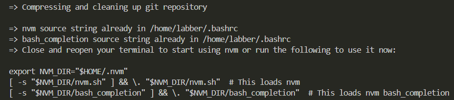

# How to Install and Configure Node.js + npm on Ubuntu 20.04
**Introduction**

[Node.js](https://nodejs.org/en/about) is a cross-platform, open-source JavaScript runtime environment that can run on server-side. [NPM](https://nodejs.org/en/learn/getting-started/an-introduction-to-the-npm-package-manager) (Node Package Manager) is a default package manager for Node.js.
By the end of this tutorial, you will have Node.js and NPM installed and ready to start developing applications in JavaScript.
## Prerequisites
Before installing anything, make sure your system is up to date. Run this command directly in your Ubuntu terminal:

```sudo apt update && sudo apt upgrade -y```

This ensures you have the latest version of packages on your Ubuntu system.

## Option 1 - Install Node.js with Apt (recommended)
This is the most popular way to get the latest version of Node.js and NPM.

**Step 1 - Install Node.js and NPM**

```sudo apt install -y nodejs```

**Step 2 - Check if the installation was successful**

```node -v```

You will get Node.js 16.z.z or 18.w.w

```npm -v```

You will get NPM npm 8.z.z to 10.w.w


>If NPM failed to install, run ```sudo apt install npm```

You have successfully installed **Node.js** and **NPM**

## Option 2 - Install Node.js with [Node Version Manager](https://github.com/nvm-sh/nvm?tab=readme-ov-file#about)
This way of installing Node.js allows you to intall and switch between many different versions of Node.js. Initially, you will get the latest versions for both Node.js and NPM.

**Step 1 - Install NVM**

```curl -o- https://raw.githubusercontent.com/nvm-sh/nvm/v0.39.7/install.sh | bash```

In your terminal, the last lines will look something like this:



Then restart your terminal or run:

```source ~/.bashrc```

**Step 2 - Install Node.js with NVM:**

```nvm install --lts```

```nvm use --lts```

You will get the latest Node.js version.