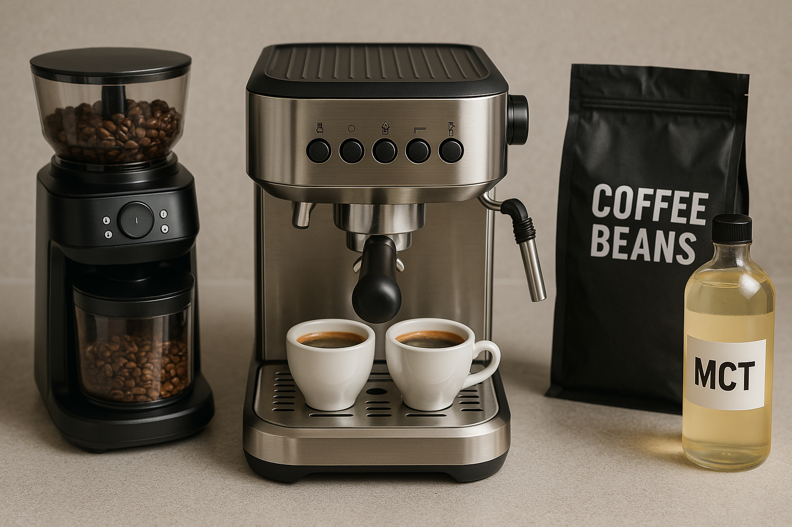

# ☕ How to Start Brewing Bulletproof Espresso at Home
## ✅ Learn how to choose the right equipment, proper coffee beans and other ingredients for your bulletproof coffee.

**Bulletproof coffee** is a high-fat, low-carb beverage made by blending freshly brewed coffee with unsalted grass-fed butter, MCT oil, or coconut oil (medium-chain triglyceride oil). It provides sustained energy, mental clarity, and appetite control, especially for people following a ketogenic or intermittent fasting diet.

Bulletproof espresso can help:
- Provide a gradual release of energy
- Support your digestive health
- Manage your blood sugar
- Aid in weight loss

---

## 🧰 Things You Will Need:
- Espresso machine
- Bean grinder
- Coffee beans
- Oil (MCT, coconut, or butter)
- Espresso cups

---

### 🔧 Beginner-Friendly Espresso Machine
#### Choose a simple machine that won't overwhelm you. Consider:
- Intuitive controls and features that simplify the brewing process.
- Clear instructions and online tutorials.
- Stable pump with consistent pressure.
- Easy to disassemble and clean.

---

### ⚙️ Find a Convenient Grinder
#### A good coffee bean grinder determines most of your brewing experience and taste.
> **!Note:** If your espresso machine already has a built-in grinder, you may skip this section.

**A good grinder should have:**
- **Grind modes:** Consistent grind size (fine for espresso)
- **Serving amount selector:** Precise portioning

**Avoid blade grinders due to:**
- **Inconsistent grind size**
- **Manual bean measurement every time**

---

### 🌱 Choose your bean roast
#### There are four main roast levels:
- **Light roast** — Bright acidity, fruity or floral notes
- **Medium roast** — Balanced acidity and sweetness  
- **Medium-dark roast** — Lower acidity, bittersweet notes  
- **Dark roast** — Bold, smoky, heavy-bodied  

#### Which one is best for you?
- Most popular: **Medium-dark roast** or **dark roast**
- Alternative: **Medium roast** for balanced flavor

---

### 🧈 Oils for Bulletproof Espresso
#### Adding oil slows caffeine absorption and gives smoother energy.
- **MCT oil** — Fast-absorbing liquid fat for clean energy 
- **Coconut oil** — Healthy fats, tropical flavor, solid when cold
- **Butter** — Rich, creamy texture

MCTs are rapidly absorbed by the liver and converted into ketones — an alternative energy source for the brain, giving you mental clarity without sugar crashes.

---

### 🍬 Optional: Add Flavors & Sweeteners
#### Use only keto-friendly sweeteners:
- **Monk fruit** — Zero-calorie, no blood sugar spike
- **Erythritol** — Zero-calorie sugar alcohol, minimal GI impact
- **Allulose** — Zero-calorie, sugar-like taste with negligible insulin response

---

### ☕ The Best Espresso Cup

- Holds **2–3 oz (60–90 ml)**  
- Enough for a **single or double shot** with room for oil/sweeteners  

---

## 🧪 Step-by-Step Brewing Guide
### Once you have all the items above, let's start:
1. **Add oil and sweetener** to your espresso cup.
2. **Place a cup** on the drip tray.
3. **Measure coffee beans** — 18 to 20 grams (for a single shot).
4. **Grind the beans** to a fine espresso texture.
5. **Transfer the grounds to the portafilter basket**, level the grounds, and tap the portafilter to get a flat surface.
6. **Tamp the grounds** with firm, level pressure.
7. **Clean portafilter edges** to ensure a tight, clean lock.
8. **Lock the portafilter and position the cup** under the spout.
9. **Start brewing.**
10. **Monitor the brewing process** — it starts with dark drips, then steady streams, and becomes golden.
11. **Stir your espresso with a teaspoon** to emulsify the fat and coffee. Mix until the texture looks smooth and slightly frothy for a more unified flavor.

> **💡Tip**: If you prefer a creamier texture, pour your espresso and fats into a larger cup or jar and use a handheld frother or small immersion blender.

---

## 🎉 Enjoy Your Bulletproof Espresso!
Drink immediately while hot. Stir if oil separates. Enjoy the smooth, energetic kick!