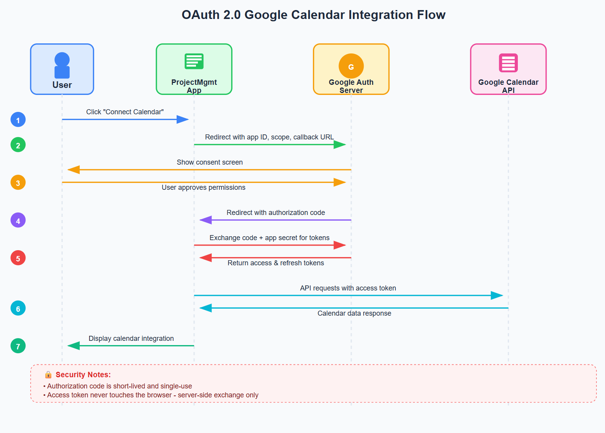
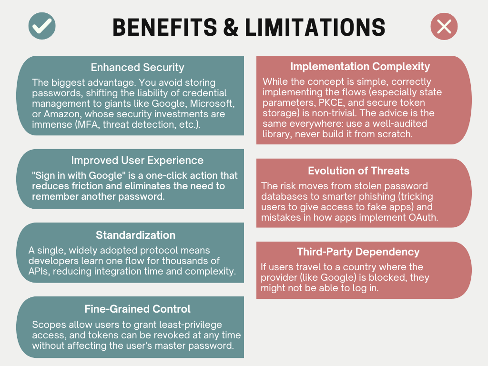

# OAuth: Why Permission Matters in a Connected World

For developers and architects building modern applications, authentication and authorization aren't just features. They are essential for protecting data and maintaining user trust. Getting them right is tricky. OAuth emerged as the key lesson.

## TL;DR

- **Problem:** Storing user passwords in apps is risky—hackers get full access.

- **Solution:** OAuth provides delegated authorization—apps get limited access via tokens without storing passwords.

- **Authentication:** OpenID Connect (OIDC) adds identity verification, like a driver’s license for apps.

- **Security basics:**
  - Validate redirect URIs

  - Use state parameters to prevent CSRF

  - Store tokens securely (avoid LocalStorage)

- **When to skip OAuth:** Internal-only apps, machine-to-machine communication, high-performance or offline-first apps.

- **OAuth 2.1 improvements:** PKCE required, risky flows removed, stricter token handling.

- **Why it matters:** Modern APIs, microservices, AI agents, and automated systems rely on safe delegated access—OAuth is essential for secure, scalable, and user-friendly systems.

## The Problem: The Risks of the "Master Key" Era

Remember the early days of web integration? To enable any functionality, we followed a pattern that now feels unwise.

**The Core Challenge:** Your new application (let's call it "MugPrintr") needs access to a user's data from another service (like Facebook) to provide value. The initial, primitive solution was to ask the user for their Facebook username and password.

This approach was full of risks:

- **Serious Security Liability:** If MugPrintr's database was hacked, the attackers didn't just get MugPrintr user data—they got the keys to your users' entire Facebook accounts.

- **Heavy User Burden:** Users were forced to trust every young startup with their  credentials. A single unknown link could expose their other accounts.

- **Tough Job for Developers:** Managing passwords meant keeping them safe, handling data leaks, and running password resets. Mistakes could be very costly.

It was like giving a food delivery service your house keys instead of just letting them into the kitchen. The risk far outweighed the necessity.

## Existing Solutions: Complicated Options

Before OAuth, options for accessing user data were inconsistent and risky: direct password sharing exposed users and services to major hacks, business-oriented solutions like SAML were too complex for everyday apps, and private APIs needed a new system for every integration. The web needed a lightweight, standard ["valet key"](https://carsmithmidlands.co.uk/blog/what-is-a-valet-key/) protocol for web apps.

## The Chosen Solution: OAuth as the "Valet Key" Protocol

OAuth came as the direct answer to these problems. It introduced a fundamental change: **delegated authorization**.

**Core Concept:** OAuth allows a user to grant a third-party application limited access to their resources hosted on another service, without sharing their credentials.

The "valet key" analogy is perfect. It allows someone to park your car but doesn't grant access to the glove box or trunk. Similarly, OAuth provides a token that grants specific, limited permissions (e.g., "read calendar events") without sharing the user's password.

### The Missing Piece: Adding Identity with OpenID Connect (OIDC)

OAuth handles authorization but doesn’t standardize authentication. This is handled by [OpenID Connect (OIDC)](https://developers.google.com/identity/openid-connect/openid-connect)—it’s an identity layer built on OAuth 2.0.

- **OAuth 2.0 provides an access token** – the valet key that lets an app access your data.

- **OIDC provides an ID token** – like a driver’s license that verifies the user’s identity.

The ID token is a JSON Web Token (JWT) that contains verifiable user information, such as the unique ID, email, and login time. This standardized format powers the “Sign in with Google” or “Sign in with Microsoft” buttons. It allows apps to delegate authentication to a trusted provider, instead of managing passwords themselves.

Together, OAuth and OIDC separate API security from user authentication, creating a complete and secure login experience.

## How OAuth Works: Step by Step

For senior engineers, the elegance of OAuth 2.0's Authorization Code flow is in its simplicity. Let's break down the typical example of your project management app needing access to a user's Google Calendar.

### The Best Part: What Doesn't Happen

- You never see the user's Google password.

- Google doesn't share the user's identity to you by default (unless you use OpenID Connect).

- The permissions are explicit and limited.

## The Security Pillars: Implementing OAuth Correctly

OAuth is secure, but only if implemented correctly. Key pillars include:

1. **Redirect URI Validation:** Only registered redirect URIs are accepted, preventing attackers from hijacking authorization flows.

2. **State Parameter:** A cryptographically random value tied to the user session defends against CSRF attacks.

3. **Secure Token Storage:** Avoid LocalStorage; store tokens server-side, in secure HTTP-only cookies, or in memory for single-page apps.

Paying attention to these basics keeps OAuth flows safe and reliable.

## Benefits and Limitations: The Real-World Tradeoffs

Like any technology, OAuth comes with its own set of tradeoffs that architects must weigh.

## When NOT to Use OAuth: Avoiding Over-Engineering

OAuth isn’t always necessary. Simpler authentication may be preferable in situations where its complexity outweighs the benefits:

- **Internal-only applications:** Apps used only within a trusted environment may rely on traditional session-based authentication.
- **Machine-to-machine communication:** Services without user involvement can use API keys or mutual TLS instead of OAuth flows.
- **High-performance applications:** OAuth’s redirects and external calls can introduce delays in latency-sensitive systems.
- **Offline or intermittently connected environments:** Apps needing offline functionality may require local authentication methods.

In these cases, simpler solutions work best.

## The OAuth 2.1 Evolution

OAuth 2.0 wasn't perfect. OAuth 2.1 is the community's combined update, bringing together years of lessons learned. Key changes include:

- **Mandating PKCE ([Proof Key for Code Exchange](https://oauth.net/2/pkce/)):** Essential for securing public clients (like mobile apps) by preventing authorization code theft.

- **Removing Risky Flows:** It officially drops the Resource Owner Password Credentials grant (the "just give me your password" flow) and the Implicit grant, reinforcing security-first principles.

- **Stricter Token Handling:** Prohibits sending access tokens in URL query strings and encourages refresh token rotation to limit the impact of token leakage.

## Conclusion: OAuth as the Non-Negotiable Standard

OAuth 2.1 is the standard for delegated authorization. Used correctly, it reduces risk, boosts trust, and future-proofs apps for web, mobile, and automated services. Implementing OAuth isn’t just a technical choice—it’s a strategic step toward secure, scalable, and user-friendly digital experiences.

References:
1. [The complete guide to protecting your APIs with OAuth2 (part 1)](https://stackoverflow.blog/2022/12/22/the-complete-guide-to-protecting-your-apis-with-oauth2/)
2. [The OAuth 2.0 Authorization Framework](https://datatracker.ietf.org/doc/html/rfc6749)
3. [The OAuth 2.1 Authorization Framework](https://www.ietf.org/archive/id/draft-ietf-oauth-v2-1-09.html)