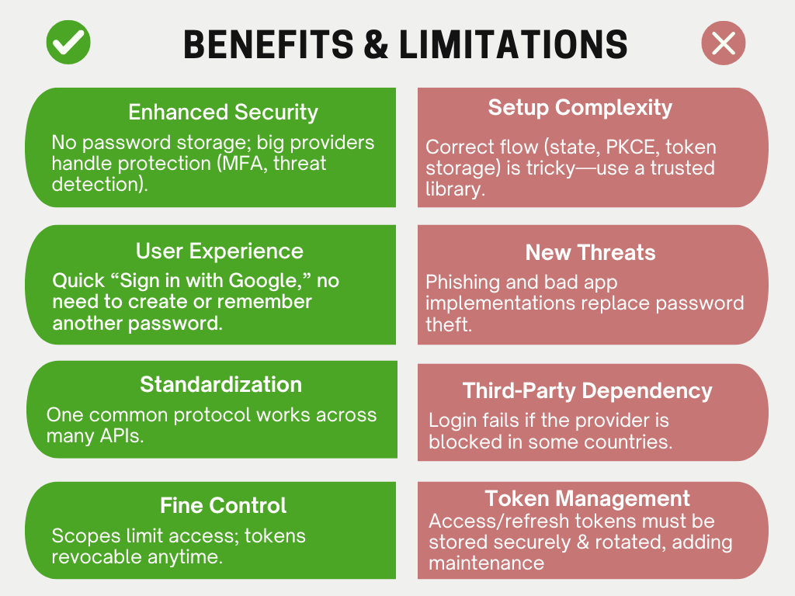

# OAuth: Why Permission Matters in a Connected World

For developers and architects building modern applications, authentication and authorization aren't just features—they’re essential for protecting data and maintaining user trust. But getting them right is notoriously difficult. After many missteps, OAuth became the main lesson learned.

## The Problem: The Risks of the "Master Key" Era

Remember the early days of web integration? To enable any functionality, we followed a pattern that now feels unwise.

**The Core Challenge:** Your new application (let's call it "MugPrintr") needs access to a user's data from another service (like Facebook) to provide value. The initial, primitive solution was to ask the user for their Facebook username and password.

This approach was full of risks:

- **Serious Security Liability:** If MugPrintr's database was hacked, the attackers didn't just get MugPrintr user data—they got the keys to your users' entire Facebook accounts.

- **Heavy User Burden:** Users were forced to trust every young startup with their  credentials. A single unknown link could expose their other accounts.

- **Tough Job for Developers:** Managing passwords meant keeping them safe, handling data leaks, and running password resets. Mistakes could be very costly.

It was like giving a food delivery service your house keys instead of just letting them into the kitchen. The risk far outweighed the necessity.

## Existing Solutions: Complicated Options

Before OAuth became the standard, it was all messy and unreliable.

- **Direct Password Sharing:** As described earlier, this was the most common but worst practice. It was a ticking time bomb for security.

- **SAML (Security Assertion Markup Language):** SAML was mainly built for large companies. It solved the problem of federated identity, but it was way too complicated for most apps people use every day. Its reliance on XML and tricky setup made it feel like “using a Thor hammer to crack a nut.” Great for logging employees into an internal portal, but more than needed if you just want users to sign up with their Google account.

- **Private APIs:** Some services offered their own authentication APIs, but this meant learning a new, non-standard system for every integration. It was inefficient and unsustainable as the number of connected services grew.

The market needed a standard, lightweight protocol designed for the age of API-driven web applications. We needed a ["valet key"](https://carsmithmidlands.co.uk/blog/what-is-a-valet-key/) for the web.

## The Chosen Solution: OAuth as the "Valet Key" Protocol

OAuth emerged as the direct answer to these problems. It introduced a fundamental shift: **delegated authorization**.

**Core Concept:** OAuth allows a user to grant a third-party application limited access to their resources hosted on another service, without sharing their credentials.

The "valet key" analogy is perfect. It allows someone to park your car but doesn't grant access to the glove box or trunk. Similarly, OAuth provides a token that grants specific, limited permissions (e.g., "read calendar events") without sharing the user's password.

### The Missing Piece: Adding Identity with OpenID Connect (OIDC)

While OAuth solves authorization, it was not designed to handle authentication in a standardized way. This is where [OpenID Connect (OIDC)](https://developers.google.com/identity/openid-connect/openid-connect) comes in. OIDC is a simple identity layer built on top of the OAuth 2.0 framework.

Think of it this way:

- **OAuth 2.0 provides an access token** – the valet key that lets the app access the garage (your data).

- **OpenID Connect provides an ID token** – a driver's license that verifies the valet's identity to the app.

The ID token is a structured JSON Web Token (JWT) that contains verifiable information about the user's authentication event, such as their unique identifier, email address, and when they logged in . This standardization is what powers the common "Sign in with Google" or "Sign in with Microsoft" buttons across the web. Instead of each application managing its own password database, they can delegate authentication to a trusted OIDC provider (like Google), which then provides a standardized set of identity information .

For architects, this separation is powerful: OAuth handles API security through scoped access tokens, while OIDC handles user authentication and Single Sign-On (SSO) functionality. They are complementary protocols used together to create a complete security story.

## How OAuth Works: Step by Step

For senior engineers, the elegance of OAuth 2.0's Authorization Code flow is in its simplicity. Let's break down the canonical example of your project management app needing access to a user's Google Calendar.

<!-- 1. **Initiation:** The user clicks "Connect Calendar" in your app. Your app redirects their browser to Google's authorization server with essential parameters: your app's ID (client_id), the desired permissions (scope), and a callback URL (redirect_uri).

2. **Authentication & Consent:** Google handles the hard part. It signs in the user through their Google account and presents a clear consent screen: "ProjectMgmtApp wants to view your calendars. Is that okay?" This is the key moment when the user grants or denies access.

3. **Authorization Grant:** If the user consents, Google redirects back to your app's redirect_uri with a short-lived, single-use authorization code.

4. **Token Exchange:** Your application server then takes this code and makes a direct, server-to-server call to Google's token endpoint. This request includes the authorization code and your application's secret (client_secret), proving that the request is legitimate. This step is crucial for security, as the sensitive token is never exposed to the user's browser.

5. **Access Granted:** Google responds with an access token (and often a refresh token). This access token is the valet key. It's a string that represents the granted permission.

6. **API Calls:** Your app includes this access token in the header of its requests to the Google Calendar API. The API validates the token and grants access according to its scopes. -->

### The Best Part: What Doesn't Happen

- You never see the user's Google password.

- Google doesn't share the user's identity to you by default (unless you use OpenID Connect).

- The permissions are explicit and limited.

## The Security Pillars: Implementing OAuth Correctly

While OAuth provides a robust framework, its security heavily depends on proper implementation. Understanding these core security pillars is essential for architects and senior engineers.

1. ### Redirect URI Validation: Closing the Open Redirect Vulnerability
OAuth 2.1 mandates exact string matching for redirect URIs, eliminating the wildcard matching allowed in earlier versions . This prevents open redirect attacks where attackers could trick users into authorizing malicious applications.

Implementation Insight: When registering your application with an authorization server, you must specify complete redirect URIs. The authorization server will reject any request with a non-matching redirect URI . For development environments, some servers allow loopback interface redirects with minimal variations in port numbers, but production systems require exact matches .

2. ### State Parameter: Your Defense Against CSRF Attacks
The state parameter is a critical but often overlooked security feature . It preserves state between the authorization request and callback, serving as a countermeasure against Cross-Site Request Forgery (CSRF) attacks.

**How it works:**

- Your application generates a unique, cryptographically random value for each authorization request

- This value is stored in the user's session and included in the authorization request

- When the authorization server redirects back to your application, you validate that the returned state parameter matches the stored value

Without this validation, an attacker could trick users into initiating OAuth flows that would ultimately link the attacker's account to the victim's session . While PKCE provides some CSRF protection, using the state parameter provides an additional layer of security .

3. ### Secure Token Storage: Avoiding the LocalStorage Trap
Where you store tokens significantly impacts application security. A common anti-pattern is storing tokens in browser LocalStorage or sessionStorage, which is vulnerable to XSS attacks .

**Secure alternatives include:**

- **HTTP-only, Secure cookies:** Prevent JavaScript access, offering protection against XSS

- **Backend token storage:** Keep tokens server-side and use session cookies

- **Memory-only storage:** For single-page applications, though this requires reauthentication on page refresh

For confidential clients (traditional web applications with a backend), the backend should handle token storage. For public clients (SPAs, mobile apps), consider using the Backend for Frontend (BFF) pattern or relying on short-lived tokens with secure refresh token handling .

## Benefits and Limitations: The Real-World Tradeoffs

Like any technology, OAuth comes with its own set of tradeoffs that architects must weigh.

<!-- ### Benefits

- **Enhanced Security:** The biggest advantage. You avoid storing passwords, shifting the liability of credential management to giants like Google, Microsoft, or Amazon, whose security investments are immense (MFA, threat detection, etc.).

- **Improved User Experience:** "Sign in with Google" is a one-click action that reduces friction and eliminates the need to remember another password.

- **Standardization:** A single, widely adopted protocol means developers learn one flow for thousands of APIs, reducing integration time and complexity.

- **Fine-Grained Control:** Scopes allow users to grant least-privilege access, and tokens can be revoked at any time without affecting the user's master password.

### Limitations

- **Implementation Complexity:** While the concept is simple, correctly implementing the flows (especially state parameters, PKCE, and secure token storage) is non-trivial. The advice is the same everywhere: use a well-audited library, never build it from scratch.

- **Evolution of Threats:** The risk moves from stolen password databases to smarter phishing (tricking users to give access to fake apps) and mistakes in how apps implement OAuth.

- **Third-Party Dependency:** If users travel to a country where the provider (like Google) is blocked, they might not be able to log in. -->

## When NOT to Use OAuth: Avoiding Over-Engineering

Despite its advantages, OAuth isn't always the right solution. Understanding when to avoid it is as important as knowing how to implement it correctly.

1. ### Simple Internal Applications Without External Integration
If you're building an internal application that doesn't need to access external APIs or allow login through third-party providers, traditional session-based authentication might be simpler and more appropriate. The complexity of implementing and maintaining an OAuth ecosystem may not be justified for applications with simple authentication needs.

2. ### Machine-to-Machine Communication Without User Context
When one service needs to communicate with another service without any user involvement (server-to-server API communication), the OAuth 2.0 Client Credentials flow is an option. However, if both services are under your control and in a trusted environment, simpler authentication methods like mutual TLS (mTLS) or API keys with proper scoping might be more straightforward .

3. ### Performance-Sensitive Applications with Tight Latency Requirements
The multiple redirects and external calls involved in OAuth flows introduce latency. For applications where every millisecond counts (high-frequency trading platforms, real-time gaming), the overhead of OAuth might be unacceptable. In these cases, consider whether the security benefits outweigh the performance costs.

4. ### Environments with Limited Network Connectivity
Applications that need to function in offline or intermittently connected environments may struggle with OAuth, which typically requires communication with external authorization servers. In these scenarios, alternative authentication methods that can function offline might be more appropriate.

## The OAuth 2.1 Evolution

OAuth 2.0 wasn't perfect. OAuth 2.1 is the community's combined update, integrating a decade of lessons learned. Key changes include:

- **Mandating PKCE ([Proof Key for Code Exchange](https://oauth.net/2/pkce/)):** Essential for securing public clients (like mobile apps) by preventing authorization code interception attacks.

- **Removing Risky Flows:** It officially drops the Resource Owner Password Credentials grant (the "just give me your password" flow) and the Implicit grant, reinforcing security-first principles.

- **Stricter Token Handling:** Prohibits sending bearer tokens in URL query strings and encourages refresh token rotation to limit the impact of token leakage .

## Conclusion: Why OAuth is the Bedrock for the Next Wave of Computing

OAuth is no longer just a convenience for social login. It has become the universal language of permission for a hyper-connected world. Its relevance is growing, not diminishing, as technology advances:

- **AI and Agents:** When an AI assistant needs to book a meeting or send an email on your behalf, it will use OAuth to get your delegated permission.

- **Internet of Things (IoT):** The OAuth 2.0 Device Authorization Grant is designed specifically for devices with no keyboard, allowing your smart TV to get permission to access your streaming services.

- **Microservices and APIs:** The same token-based method is applied inside the app with patterns like JWT-based authentication between microservices, creating a consistent security model.

### The Bottom Line for Technical Decision-Makers
Adopting OAuth 2.1 patterns is no longer an optional best practice; it's a baseline requirement for building trustworthy, scalable applications. It represents a mature approach to digital trust, moving us away from the dangerous era of credential sharing.

By leveraging OAuth, you are not just implementing a protocol; you are making a strategic decision to:

- **Minimize risk** by not owning sensitive password data.

- **Enhance user trust** through transparent consent and control.

- **Future-proof your architecture** by using the standard that supports modern web, mobile, and automated service interactions.

The question is no longer if you should use OAuth, but how you can use it more effectively and securely across all your applications. It’s the permission slip your apps actually need, and the one your users deserve.

References:
1. [The complete guide to protecting your APIs with OAuth2 (part 1)](https://stackoverflow.blog/2022/12/22/the-complete-guide-to-protecting-your-apis-with-oauth2/)
2. [The OAuth 2.0 Authorization Framework](https://datatracker.ietf.org/doc/html/rfc6749)
3. [The OAuth 2.1 Authorization Framework](https://www.ietf.org/archive/id/draft-ietf-oauth-v2-1-09.html)