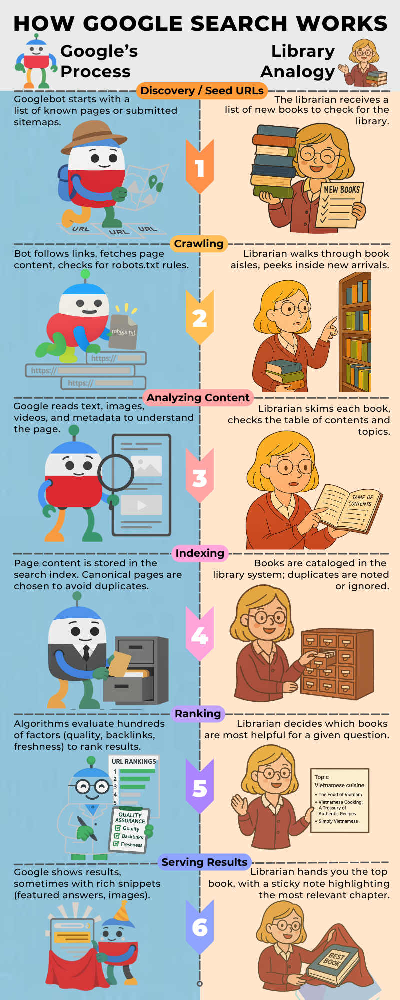

# Inside a Google Search: How It Works [Infographic]

## Introduction

We live in an era where technology shapes almost every part of our daily lives. From smartphones to smart homes, advanced devices make things easier—but we rarely stop to ask how they actually work. Have you ever wondered what happens behind the scenes when you type a query into Google?

This blog is for anyone curious about technology, digital marketing, research, or just understanding the web better. We'll explore how Google Search scans billions of web pages and decides which results to show. And if you’re not a tech expert, don’t worry. The infographic below breaks down each step of a Google search by comparing it to a librarian finding the right information in a library. making complex processes simple and visual.

## Infographic
The infographic below demonstrates each stage of the Google Search process—discovery, crawling, analyzing content, indexing, ranking, serving results—using a librarian's process as a simplified visual guide.

## Quick Summary:
- **Crawling** - Google uses bots (crawlers) to scan the web.
- **Indexing** - Pages are stored in an index, like a digital library.
- **Serving** - Algorithms decide what’s most relevant to your query.

If you feel it’s necessary, copy the wording from the original infographic into this section and add more context, backlinks, sources, and information. You can also use this as an opportunity to help the post rank, as search engines can crawl the text in the body of a blog post. 

## Final Thoughts

Understanding how Google Search works isn't just trivia—it's practical power. If you run a business, knowing that Google only shows indexed and relevant results can help you improve your SEO strategy. And even if you're just curious, next time when you type a query, you'll know the invisible steps behind the scenes.

## Next Steps

Curiosity doesn't stop here. To go deeper, explore [Google Search Central](https://developers.google.com/search) for official insights—or, if you’re ready to make your site more discoverable, let’s talk about how we can optimize your content for Google..

## Sources & References
- This infographic was inspired by [Google’s official guide on How Search Works](https://developers.google.com/search/docs/fundamentals/how-search-works)
 and additional research from trusted SEO sources.