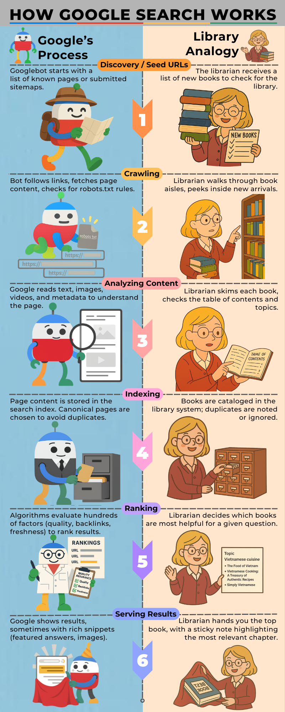

# Inside a Google Search: How It Works [Infographic]

## Introduction

We live in an era where technology shapes almost every part of our daily lives. From smartphones to smart homes, advanced devices make things easier—but we rarely stop to ask how they actually work. Have you ever wondered what happens behind the scenes when you type a query into Google?

This blog is for anyone curious about technology, digital marketing, research, or just understanding the web better. We'll explore how Google Search scans billions of web pages and decides which results to show. And if you’re not a tech expert, don’t worry. The infographic below breaks down each step of a Google search by comparing it to a librarian finding the right information in a library, making complex processes simple and visual.

## Infographic
The infographic below demonstrates each stage of the Google Search process—discovery, crawling, content analysis, indexing, ranking, serving results—using a librarian's process as a simplified visual guide.

## Step-by-Step Breakdown

### 1. **Discovery** — Google starts with known URLs and submitted sitemaps, like a librarian beginning with a list of familiar books and a delivery list of new arrivals.
### 2. **Crawling** — Crawler bots  scan the web, fetch page content, and check `robots.txt`, similar to a librarian reviewing each book from a new arrival stack.
### 3. **Content Analysis** — Google analyzes text, images, videos, and metadata to understand a page; a librarian skims each book's content and chapters.
### 4. **Indexing** — Pages are stored in a searchable index (the digital library); canonical tags are used to avoid duplicates, like cataloging one definitive copy.
### 5. **Ranking** — Algorithms evaluate hundreds of page signals (quality, backlinks, freshness) to rank results; a librarian picks the best books for the library visitor's question.
### 6. **Serving** — The most relevant results are returned to your query, like the librarian handling you the most useful book with a sticky note pointing to the right chapter.

If you feel it’s necessary, copy the wording from the original infographic into this section and add more context, backlinks, sources, and information. You can also use this as an opportunity to help the post rank, as search engines can crawl the text in the body of a blog post. 

## Final Thoughts

Understanding how Google Search works isn't just trivia—it's practical power. If you run a business, knowing that Google only shows indexed and relevant results can help you improve your SEO strategy. And even if you're just curious, next time you type a query, you'll know the invisible steps behind the scenes.

## Next Steps

Curiosity doesn't stop here. To go deeper, explore [Google Search Central](https://developers.google.com/search) for official insights—or, if you’re ready to make your site more discoverable, let’s talk about how we can optimize your content for Google..

## Short glossary (useful for non-technical readers)

### **Sitemap**: A file that lists a website’s URLs to help crawlers discover pages.

### **robots.txt**: A site file telling crawlers which parts they may or may not access.

### **Canonical tag**: A signal that marks the preferred version of a page to avoid indexing duplicates.

### **Backlink**: A link from another site — an important signal of authority.

### **Featured snippet / rich snippet**: Extra info shown directly on the results page (e.g., the short answer box, images, star ratings).

### **Index**: Google’s stored database of page content that can be searched.

## Sources & References
- This infographic was inspired by [Google’s official guide on How Search Works](https://developers.google.com/search/docs/fundamentals/how-search-works)
 and additional research from trusted SEO sources.